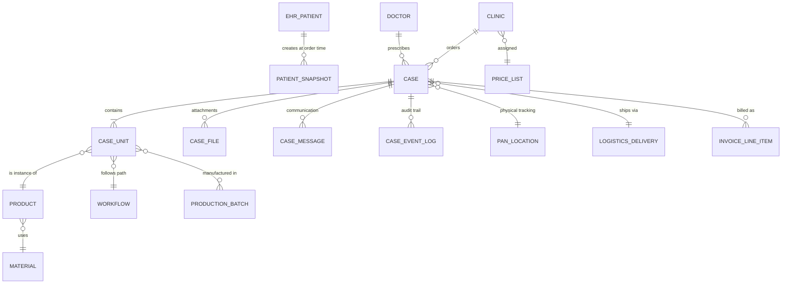
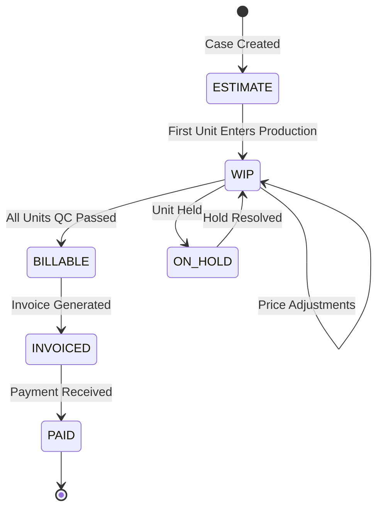

# Lab Portal - Cases Domain Technical & UX Analysis

**Enterprise Architecture Document**

**Date:** November 30, 2025  
**Version:** 2.0  
**Authors:** UI/UX Architect & Full-Stack Engineering Team

---

## Executive Summary

The Cases Domain serves as the **operational nucleus** of the Lab Portal, orchestrating workflows across clinical intake, digital manufacturing, financial reconciliation, and logistics coordination. Analysis of the current React implementation reveals a solid foundation with critical opportunities for backend optimization.

### Current Architecture Strengths
- **Granular Unit Tracking**: Proper separation of Case → Units (teeth-level state management)
- **Workflow Flexibility**: Dynamic workflow system supporting 13+ production paths
- **Multi-tenant Design**: Lab-scoped data isolation via `labId` filtering
- **Event-Driven Messaging**: Real-time case communication with role-based visibility

### Critical Gaps Requiring Resolution

| **Domain** | **Gap** | **Impact** | **Priority** |
|------------|---------|------------|--------------|
| **Data Model** | Denormalized units array in Case document | Write conflicts under concurrent updates | **Critical** |
| **Finance** | Snapshot-based pricing vs. audit trail | No visibility into price changes over time | **High** |
| **Files** | Missing SHA-256 checksums & version lineage | Liability risk for medical device tracking | **Critical** |
| **Patient Data** | Full PHI embedded in Case object | HIPAA violation risk; replication overhead | **High** |
| **Workflow** | No state machine enforcement | Users can bypass QC stages | **Medium** |

---

## 1. Mock Data Audit & Validation

### 1.1 active_cases.json Analysis

**Schema Examination:**
```json
{
  "id": "case-5001",
  "status": "stage-design",
  "units": [
    {
      "id": "unit-5001-14",
      "tooth": 14,
      "type": "Crown",
      "material": "Zirconia Full Contour",
      "status": "stage-design"
    }
  ],
  "financial": { "estimatedTotal": 99.00 },
  "panNumbers": ["A12", "B4"]
}
```

**Findings:**

Concurrency Risk: If a Ceramist updates Unit #1 status and a CAD tech updates Unit #2 status simultaneously on the same Case document, write conflicts will occur.

**✅ Strengths:**
- **Pan Tracking**: `panNumbers` array links digital records to physical lab locations
- **Unit-Level Granularity**: Independent status tracking per tooth/restoration
- **Multi-Unit Cases**: Proper support for bridges (case-5007: 3-unit bridge)
- **Financial Snapshot**: Clear separation of `estimatedTotal` vs. final invoice

**⚠️ Critical Issues:**

1. **Concurrency Risk (P0)**
   - **Problem**: Nested `units[]` array causes write conflicts when multiple technicians update different units simultaneously
   - **Solution**: Migrate to separate `CaseUnits` table with composite key `(caseId, unitId)`

2. **Missing Product Linkage (P1)**
   - **Problem**: Units use free-text `type: "Crown"` instead of `productId: "prod-zirc-crn"`
   - **Impact**: Price calculations rely on fragile string matching
   - **Solution**: Add `productId` foreign key to `products.json`

3. **Unit-Level Hold State (P1)**
   - **Problem**: `holdReason` only exists at case level
   - **Reality**: Individual units can be held independently (margin issue on #8, while #9 proceeds)
   - **Solution**: Move `holdReason` and `heldAtStageId` into unit schema

### 1.2 Workflow State Machine Validation

**Current Implementation Analysis:**

The system defines workflows in two layers:
- **System Stages** (`case_stages.json`): 14 canonical states with order sequence
- **Lab Workflows** (`workflows.json`): 13 predefined paths mapping stages to product types

**Validation Results:**

| **Workflow** | **Stages** | **Valid Transitions** | **Issues** |
|--------------|------------|----------------------|------------|
| `wf-crown-digital-001` | 7 stages | ✅ Linear progression | None |
| `wf-denture-complete-001` | 9 stages | ✅ Includes try-in | None |
| `wf-partial-cast-002` | 12 stages | ⚠️ **Duplicate `stage-tryin`** | Two try-in steps (framework + wax) using same stage ID |

**Critical Gap: No State Machine Enforcement**
```typescript
// Current: Any status can transition to any other status
updateCaseStatus(caseId, "stage-shipped") // ❌ Bypasses QC

// Required: Workflow-aware validation
const validNextStages = getValidTransitions(currentStage, workflowId);
if (!validNextStages.includes(nextStage)) throw new Error("Invalid transition");
```

### 1.3 File Management Schema Review

**`case_files.json` Analysis:**

**✅ Well-Designed Aspects:**
- Hierarchical categorization (`category` → `subCategory`)
- Version tracking (`version`, `isLatest`, `parentFileId`)
- Immutability flag (`isImmutable` for original scans)

**⚠️ Missing Critical Metadata:**

| **Field** | **Purpose** | **Priority** |
|-----------|-------------|--------------|
| `sha256Hash` | File integrity verification | **Critical** |
| `contentType` | MIME type for proper rendering | **High** |
| `metadata.vertexCount` | STL mesh complexity (for viewer optimization) | **Medium** |
| `metadata.softwareVersion` | Design software compatibility tracking | **High** |
| `encryptionKeyId` | KMS key reference for PHI-containing files | **Critical** |

---

## 2. Entity Relationship Architecture

### 2.1 Domain Boundary Definition



### 2.2 Data Ownership & Integration Boundaries

**Design Principle:** Each domain owns its data; cross-domain access occurs via events or read-only projections.

| **Domain** | **Owns** | **Reads From** | **Integration Method** |
|------------|----------|----------------|------------------------|
| **Cases** | Case metadata, Units, Files, Messages | Clinics, Doctors, Products, Price Lists | Direct query (cached) |
| **Production** | Batches, Equipment logs, Material consumption | Case Units (via `caseId` filter) | EventBridge: `CaseUnit.StatusChanged` |
| **Finance** | Invoices, Payments, Ledger | Cases (for line items), Price Lists | EventBridge: `Case.Completed` |
| **Logistics** | Routes, Deliveries, Tracking | Cases (where `status=stage-shipping`) | Query projection: `DeliveryCases` view |
| **EHR Core** | Patients, Appointments, Medical history | None (publishes snapshots only) | API: `GET /patients/{id}/snapshot` |

**Critical Architectural Decision:**
- **Patient Data**: Lab Portal stores `PatientSnapshot` (name, age, gender, chartNumber) at case creation time
- **Rationale**: Minimizes PHI replication, complies with HIPAA "minimum necessary" rule
- **Trade-off**: If patient name changes in EHR, historical cases show old name (acceptable for medical device traceability)

---

## 3. Lab Portal Architecture

### 3.1 Domain Module Structure

The current implementation uses **React Context-based state management** with domain separation:

```
src/
├── contexts/
│   ├── LabContext.jsx          ← Cases domain state
│   ├── CrmContext.jsx           ← Clinics/Doctors/Products
│   ├── ProductionContext.jsx    ← Batches/Materials/Equipment
│   ├── LogisticsContext.jsx     ← Routes/Deliveries
│   └── FinanceContext.jsx       ← Invoices/Payments
├── pages/
│   ├── cases/
│   │   ├── CaseList.jsx         ← Kanban/Table view
│   │   └── CaseDetail.jsx       ← Single case cockpit
└── components/
    └── cases/
        ├── detail/
        │   ├── CaseDetailHeader.jsx
        │   ├── CaseDetailStepper.jsx    ← Workflow progress
        │   ├── CaseUnitsList.jsx         ← Per-tooth status
        │   ├── CaseFilesCard.jsx         ← STL/PDF viewer launcher
        │   ├── CaseCommunicationCard.jsx ← Message thread
        │   └── UniversalFileViewer.jsx   ← 3D/PDF renderer
        └── CaseForm.jsx                  ← Create/Edit modal
```

**Key Components:**

1. **CaseDetailStepper**: Implements workflow-aware progress tracking
   - Detects workflow type from unit categories (Removable/Casting/Ortho/Implant/Fixed)
   - Falls back to hardcoded workflows if `workflowId` not assigned
   - **Gap**: No state machine validation (relies on UI to hide invalid transitions)

2. **CaseFilesCard**: Multi-format file handling
   - **Supported**: STL (3D meshes), PDF (prescriptions), JPG/PNG (shade photos)
   - **Integration**: Launches `UniversalFileViewer` for in-browser rendering
   - **Missing**: Batch download, version comparison view

### 3.2 Role-Based Access Control (RBAC)

**Implementation:** `AuthContext.jsx` provides `hasRole()` and `hasPermission()` helpers

**Permission Matrix:**

| **Role** | **Scope** | **Case Read** | **Case Write** | **Finance** | **Production** |
|----------|-----------|---------------|----------------|-------------|----------------|
| `role-admin` | All Labs | ✅ All | ✅ All | ✅ Full | ✅ Full |
| `role-manager` | Own Lab | ✅ All | ✅ Status/Notes | ✅ View/Edit | ❌ View Only |
| `role-tech-cad` | Own Lab | ✅ Assigned | ✅ Design stages | ❌ Hidden | ✅ Create batches |
| `role-tech-ceram` | Own Lab | ✅ Assigned | ✅ Production stages | ❌ Hidden | ✅ Update status |
| `role-driver` | Routes | ✅ Delivery info | ✅ Shipping status | ❌ Hidden | ❌ None |
| `role-client` | Own Clinic | ✅ Own cases | ✅ Create/Hold/Message | ✅ View estimates | ❌ None |

### 3.3 Cross-Domain Integration Points

**Event-Driven Architecture:** Cases domain publishes events consumed by other modules

| **Integration** | **Trigger Event** | **Action** | **Implementation** |
|-----------------|-------------------|------------|-------------------|
| **Finance** | `Case.StatusChanged → stage-shipping` | Generate invoice line items | EventBridge rule → Lambda `generateInvoice` |
| **Production** | `CaseUnit.StatusChanged → stage-milling` | Add unit to batch queue | EventBridge → Lambda `scheduleBatch` |
| **Logistics** | `Case.StatusChanged → stage-shipping` | Create delivery task | EventBridge → Lambda `createDeliveryTask` |
| **File Processing** | `CaseFile.Uploaded` | Generate thumbnail, extract STL metadata | S3 Event → Lambda `processFile` |
| **Notifications** | `CaseMessage.Created` (isInternal=false) | Send email/SMS to doctor | EventBridge → SNS topic |

**Data Flow Example: Case Completion**
```typescript
// 1. Frontend triggers status update
await updateCaseStatus(caseId, 'stage-qc');

// 2. LabContext publishes event
EventBridge.putEvents({
  DetailType: 'CaseUnit.StatusChanged',
  Detail: { caseId, unitId, newStatus: 'stage-qc', labId }
});

// 3. Multiple subscribers react
// - Finance: Check if all units complete → generate invoice
// - Production: Update batch status
// - Audit: Log state transition
```

---

## 4. Cases Domain Deep Dive

### 4.1 Optimized Data Models for AWS

**DynamoDB Single-Table Design:**

```typescript
// Primary Key Structure: Enables all query patterns
type CaseTableItem = 
  | CaseEntity 
  | CaseUnitEntity 
  | CaseFileEntity 
  | CaseMessageEntity;

// Case Metadata
interface CaseEntity {
  PK: `LAB#${labId}`;                    // Partition Key
  SK: `CASE#${caseId}`;                  // Sort Key
  GSI1PK: `CLINIC#${clinicId}`;          // Query by clinic
  GSI1SK: `CASE#${createdDate}`;         // Sort by date
  
  caseNumber: string;                     // "2025-1001"
  patientSnapshot: {                      // Encrypted at rest
    name: string;
    age: number;
    gender: string;
    chartNumber?: string;
  };
  doctorId: string;
  aggregatedStatus: CaseStage;            // Derived from units
  financialStatus: 'ESTIMATE' | 'INVOICED' | 'PAID';
  panNumbers: string[];                   // Physical location
  tags: string[];
  
  dates: {
    created: string;                      // ISO-8601
    received?: string;
    due: string;
    shipped?: string;
  };
}

// Individual Units (Teeth/Restorations)
interface CaseUnitEntity {
  PK: `CASE#${caseId}`;
  SK: `UNIT#${unitId}`;
  GSI2PK: `WORKFLOW#${workflowId}`;       // Query units by workflow type
  GSI2SK: `STATUS#${currentStage}`;       // Find units at specific stage
  
  tooth?: number;                         // FDI notation (11-48)
  arch?: 'UPPER' | 'LOWER' | 'BOTH';
  productId: string;                      // FK to products.json
  material: string;
  shade?: string;
  
  currentStage: CaseStage;
  workflowId: string;
  holdReason?: string;                    // Unit-level hold
  heldAtStage?: CaseStage;
  
  pricing: {
    listPrice: number;                    // From price list at creation
    adjustments: number;                  // Rush fees, material upgrades
    finalPrice: number;
  };
  
  productionMetadata?: {
    batchId?: string;                     // Traceability to production batch
    machineId?: string;
    materialLotNumber?: string;
  };
}
```

### 4.2 Finance Integration Architecture

**Current Gap:** `financial.estimatedTotal` is a static snapshot with no audit trail

**Required Solution:** Ledger-Based Pricing System

**Financial State Transitions:**



**Required Helper Utilities:**

```typescript
// src/utils/pricing/priceCalculator.ts
export async function calculateUnitPrice(
  productId: string,
  clinicId: string,
  addons: string[] = []
): Promise<number> {
  const clinic = await getClinic(clinicId);
  const priceList = await getPriceList(clinic.priceListId);
  const basePrice = priceList.items[productId]?.price || 0;
  
  // Apply volume discounts, rush fees, addons
  const addonTotal = addons.reduce((sum, addonId) => 
    sum + (priceList.addons[addonId]?.price || 0), 0);
  
  return basePrice + addonTotal;
}

// src/utils/pricing/taxEngine.ts
export function calculateTax(
  amount: number, 
  clinicAddress: Address
): { taxRate: number; taxAmount: number } {
  // Dental prosthetics are tax-exempt in most US states
  // but taxable in Canada (HST/GST) and EU (VAT)
  if (clinicAddress.country === 'US') return { taxRate: 0, taxAmount: 0 };
  if (clinicAddress.country === 'CA') return { taxRate: 0.13, taxAmount: amount * 0.13 };
  // ... handle EU VAT by country
}
```

### 4.3 State Machine & Event Lifecycle

**Workflow State Validation:**

Current implementation allows technicians to manually select any stage. Production requires **enforced transitions**.

```typescript
// src/utils/workflow/stateMachine.ts
export class CaseWorkflowStateMachine {
  private workflow: Workflow;
  
  constructor(workflowId: string) {
    this.workflow = getWorkflowById(workflowId);
  }
  
  getValidNextStages(currentStage: CaseStage): CaseStage[] {
    const currentIndex = this.workflow.stages.indexOf(currentStage);
    if (currentIndex === -1) return [];
    
    // Allow progression to next stage, or backwards 1 step (for corrections)
    return [
      this.workflow.stages[currentIndex + 1],  // Forward
      this.workflow.stages[currentIndex - 1]   // Back (optional)
    ].filter(Boolean);
  }
  
  canTransition(from: CaseStage, to: CaseStage): boolean {
    // Special rules
    if (to === 'stage-hold') return true;  // Can hold from any stage
    if (from === 'stage-hold') return true; // Can resume to previous stage
    
    return this.getValidNextStages(from).includes(to);
  }
}
```

**Critical Events Published by Cases Domain:**

| **Event Type** | **Payload** | **Subscribers** | **Purpose** |
|----------------|-------------|-----------------|-------------|
| `Case.Created` | `{ caseId, clinicId, units[], totalEstimate }` | Finance, Production | Initialize cost tracking, forecast materials |
| `CaseUnit.StatusChanged` | `{ caseId, unitId, fromStage, toStage }` | Production, Audit | Update batch status, log transition |
| `Case.OnHold` | `{ caseId, unitId, holdReason }` | Notifications | Alert doctor via email/SMS |
| `Case.ReadyToShip` | `{ caseId, deliveryAddress }` | Logistics, Finance | Create delivery task, finalize invoice |
---

## 5. AWS Production Architecture

### 5.1 Compute Layer (Lambda + API Gateway)

**API Gateway REST Endpoints:**

| **Method** | **Path** | **Lambda Handler** | **Purpose** | **Auth** |
|------------|----------|-------------------|-------------|----------|
| `POST` | `/cases` | `createCase` | Create new case with units | Cognito JWT |
| `GET` | `/cases` | `listCases` | Query cases by lab/clinic/status | Cognito JWT |
| `GET` | `/cases/{id}` | `getCaseDetail` | Retrieve full case + units + files | Cognito JWT |
| `PATCH` | `/cases/{id}/status` | `updateCaseStatus` | Transition workflow stage | Cognito JWT + RBAC |
| `POST` | `/cases/{id}/files` | `uploadCaseFile` | Generate S3 presigned URL | Cognito JWT |
| `GET` | `/cases/{id}/files/{fileId}` | `getCaseFile` | Return S3 presigned download URL | Cognito JWT |
| `POST` | `/cases/{id}/messages` | `addCaseMessage` | Add communication thread entry | Cognito JWT |

**Lambda Function Specifications:**

```typescript
// lambdas/cases/createCase.ts
export async function handler(event: APIGatewayProxyEvent) {
  const { labId, userId, role } = parseJWT(event.headers.Authorization);
  const input = JSON.parse(event.body);
  
  // 1. Validate permissions
  if (role === 'role-client' && input.doctorId !== userId) {
    return { statusCode: 403, body: 'Forbidden' };
  }
  
  // 2. Generate case number (lab-specific sequence)
  const caseNumber = await generateCaseNumber(labId);
  
  // 3. Calculate pricing
  const units = await Promise.all(input.units.map(async (unit) => ({
    ...unit,
    unitId: uuidv4(),
    pricing: {
      listPrice: await calculateUnitPrice(unit.productId, input.clinicId),
      adjustments: 0,
      finalPrice: 0
    }
  })));
  
  // 4. Write to DynamoDB
  await dynamoDB.transactWrite({
    TransactItems: [
      { Put: { TableName: 'CasesTable', Item: caseEntity } },
      ...units.map(u => ({ Put: { TableName: 'CasesTable', Item: unitEntity } }))
    ]
  });
  
  // 5. Publish event
  await eventBridge.putEvents({
    Entries: [{
      Source: 'lab-portal.cases',
      DetailType: 'Case.Created',
      Detail: JSON.stringify({ caseId, labId, clinicId, units })
    }]
  });
  
  return { statusCode: 201, body: JSON.stringify({ caseId, caseNumber }) };
}
```

### 5.2 Database Architecture (DynamoDB Single-Table Design)

**Table: `LabPortal-Cases`**

**Primary Access Patterns:**

| **Pattern** | **Keys Used** | **Query** | **Use Case** |
|-------------|---------------|-----------|--------------|
| Get case by ID | `PK = LAB#{labId}`, `SK = CASE#{caseId}` | GetItem | Case detail page |
| List lab cases | `PK = LAB#{labId}`, `SK begins_with CASE#` | Query | Cases list page |
| List clinic cases | `GSI1PK = CLINIC#{clinicId}` | Query (GSI1) | Doctor portal |
| Find units by stage | `GSI2PK = STAGE#{stageId}` | Query (GSI2) | Production queue |
| Get case units | `PK = CASE#{caseId}`, `SK begins_with UNIT#` | Query | Unit list rendering |
| Get case files | `PK = CASE#{caseId}`, `SK begins_with FILE#` | Query | File gallery |

**Index Configuration:**

```typescript
{
  TableName: 'LabPortal-Cases',
  BillingMode: 'PAY_PER_REQUEST', // On-Demand for variable workload
  
  AttributeDefinitions: [
    { AttributeName: 'PK', AttributeType: 'S' },
    { AttributeName: 'SK', AttributeType: 'S' },
    { AttributeName: 'GSI1PK', AttributeType: 'S' },
    { AttributeName: 'GSI1SK', AttributeType: 'S' },
    { AttributeName: 'GSI2PK', AttributeType: 'S' },
    { AttributeName: 'GSI2SK', AttributeType: 'S' }
  ],
  
  KeySchema: [
    { AttributeName: 'PK', KeyType: 'HASH' },
    { AttributeName: 'SK', KeyType: 'RANGE' }
  ],
  
  GlobalSecondaryIndexes: [
    {
      IndexName: 'GSI1-ClinicCases',
      KeySchema: [
        { AttributeName: 'GSI1PK', KeyType: 'HASH' },
        { AttributeName: 'GSI1SK', KeyType: 'RANGE' }
      ],
      Projection: { ProjectionType: 'ALL' }
    },
    {
      IndexName: 'GSI2-ProductionQueue',
      KeySchema: [
        { AttributeName: 'GSI2PK', KeyType: 'HASH' },
        { AttributeName: 'GSI2SK', KeyType: 'RANGE' }
      ],
      Projection: { ProjectionType: 'KEYS_ONLY' } // Fetch full items in batch
    }
  ],
  
  StreamSpecification: {
    StreamEnabled: true,
    StreamViewType: 'NEW_AND_OLD_IMAGES' // For audit logging
  }
}
```

**Data Encryption:**
- **At Rest**: Enable AWS KMS encryption (required for HIPAA compliance)
- **In Transit**: TLS 1.2+ enforced via API Gateway
- **Field-Level**: Encrypt `patientSnapshot` using AWS Encryption SDK with separate CMK

### 5.3 File Storage (S3 + CloudFront)

**Bucket Strategy:**

```
s3://lab-portal-files-{env}/
├── {labId}/
│   ├── cases/
│   │   ├── {caseId}/
│   │   │   ├── inputs/
│   │   │   │   ├── {fileId}-v1.stl
│   │   │   │   └── prescription.pdf
│   │   │   ├── designs/
│   │   │   │   ├── {fileId}-v1.stl
│   │   │   │   ├── {fileId}-v2.stl  ← Versioned
│   │   │   └── thumbnails/
│   │   │       └── {fileId}.png
```

**Security Configuration:**

```json
{
  "Version": "2012-10-17",
  "Statement": [
    {
      "Effect": "Deny",
      "Principal": "*",
      "Action": "s3:*",
      "Resource": "arn:aws:s3:::lab-portal-files-prod/*",
      "Condition": {
        "Bool": { "aws:SecureTransport": "false" }
      }
    }
  ]
}
```

**Lifecycle Policies:**
- **Active Cases** (0-90 days): S3 Standard
- **Completed Cases** (90 days - 2 years): S3 Standard-IA (Infrequent Access)
- **Archived Cases** (2+ years): S3 Glacier Instant Retrieval
- **Legal Hold**: Cases flagged for litigation exempt from deletion (7+ years)

### 5.4 Event-Driven Integration (EventBridge)

**Event Bus Architecture:**

```
┌─────────────────┐
│  Cases Domain   │
│   (Publisher)   │
└────────┬────────┘
         │ EventBridge
         ▼
┌────────────────────────────────────────┐
│         Default Event Bus              │
│  Source: lab-portal.cases              │
└─┬─────────┬──────────┬─────────┬───────┘
  │         │          │         │
  ▼         ▼          ▼         ▼
┌──────┐ ┌────────┐ ┌──────┐ ┌───────┐
│Finance│ │Production│ │Logistics│ │Audit  │
│Lambda │ │ Lambda  │ │ Lambda │ │Lambda │
└──────┘ └────────┘ └──────┘ └───────┘
```

**EventBridge Rules:**

| **Rule Name** | **Event Pattern** | **Target** | **Action** |
|---------------|-------------------|------------|------------|
| `CaseCreated-ToFinance` | `DetailType: "Case.Created"` | Lambda: `initializeFinancialLedger` | Create WIP ledger entry |
| `CaseShipped-ToLogistics` | `DetailType: "Case.ReadyToShip"` | Lambda: `createDeliveryTask` | Add case to logistics queue |
| `UnitStatusChanged-ToProduction` | `DetailType: "CaseUnit.StatusChanged"`<br>`Detail.toStage: "stage-milling"` | Lambda: `enqueueBatchJob` | Add unit to milling queue |
| `CaseOnHold-ToNotifications` | `DetailType: "Case.OnHold"` | SNS Topic: `CaseAlerts` | Send email/SMS to doctor |
| `FileUploaded-ToProcessor` | `DetailType: "CaseFile.Uploaded"` | Lambda: `processSTLFile` | Generate thumbnail, extract metadata |
| `AllEvents-ToAudit` | `Source: "lab-portal.cases"` | Kinesis Firehose | Stream to S3 for compliance logging |

**Event Schema Example:**

```json
{
  "version": "0",
  "id": "uuid",
  "detail-type": "CaseUnit.StatusChanged",
  "source": "lab-portal.cases",
  "account": "123456789",
  "time": "2025-11-30T14:30:00Z",
  "region": "us-east-1",
  "resources": ["arn:aws:dynamodb:us-east-1:123456789:table/LabPortal-Cases"],
  "detail": {
    "labId": "lab-001",
    "caseId": "case-5001",
    "unitId": "unit-5001-14",
    "fromStage": "stage-design",
    "toStage": "stage-milling",
    "changedBy": "user-tech-01",
    "timestamp": "2025-11-30T14:30:00Z"
  }
}
```

### 5.5 Real-Time Updates (AppSync GraphQL Subscriptions)

**Why AppSync over WebSockets:**
- Managed scaling (no connection management overhead)
- Built-in Cognito integration
- GraphQL schema provides type safety

**Subscription Schema:**

```graphql
type Subscription {
  onCaseUpdated(labId: ID!, caseId: ID!): Case
    @aws_subscribe(mutations: ["updateCaseStatus", "addCaseFile", "addCaseMessage"])
  
  onUnitStatusChanged(caseId: ID!): CaseUnit
    @aws_subscribe(mutations: ["updateUnitStatus"])
}

type Case {
  id: ID!
  caseNumber: String!
  status: CaseStage!
  units: [CaseUnit!]!
  updatedAt: AWSDateTime!
}
```

**Frontend Integration:**

```typescript
// In CaseDetail.jsx
const CASE_UPDATED_SUBSCRIPTION = gql`
  subscription OnCaseUpdated($labId: ID!, $caseId: ID!) {
    onCaseUpdated(labId: $labId, caseId: $caseId) {
      id
      status
      units { id status }
      updatedAt
    }
  }
`;

useSubscription(CASE_UPDATED_SUBSCRIPTION, {
  variables: { labId: activeLab.id, caseId },
  onData: ({ data }) => {
    // Auto-refresh UI without manual polling
    setCaseData(data.onCaseUpdated);
  }
});
```

---

## 6. UX & Workflow Enhancements

### 6.1 Component-Level Improvements

**CaseForm.jsx - Draft Mode:**

**Current Issue:** Requires all fields before submission  
**Enhancement:** Progressive disclosure with draft state

```typescript
interface CaseFormState {
  mode: 'DRAFT' | 'COMPLETE';
  validationLevel: 'MINIMAL' | 'FULL';
}

// Allow saving with minimal data
const minimalFields = ['clinicId', 'patient.name'];
const fullFields = [...minimalFields, 'units', 'dueDate', 'files'];

function validateForm(data: Partial<Case>, mode: CaseFormState['mode']) {
  const requiredFields = mode === 'DRAFT' ? minimalFields : fullFields;
  // ...
}
```

**CaseFilesCard.jsx - Organized Tabs:**

Replace single list with categorized tabs:
- **Inputs** (scans, photos, prescriptions)
- **Designs** (CAD outputs, design iterations)
- **Production** (milling files, QC reports)
- **Shipping** (packing slips, tracking labels)

**StatusBadge.jsx - Icon Enhancement:**

```typescript
const STAGE_ICONS = {
  'stage-design': <IconPencil />,
  'stage-milling': <IconMill />,
  'stage-qc': <IconCheckCircle />,
  'stage-shipping': <IconTruck />
};

<StatusBadge status={stage} icon={STAGE_ICONS[stage]} />
```

### 6.2 Workflow Optimization Opportunities

| **Current Pain Point** | **User Impact** | **Proposed Solution** |
|------------------------|-----------------|----------------------|
| No bulk status updates | Techs update 50+ units individually | Add "Select All" + "Batch Update Stage" |
| Missing quick filters | Searching cases requires full table scan | Add saved filter presets ("My Rush Cases", "On Hold This Week") |
| No duplicate detection | Accidentally create same case twice | Check for duplicate (patient + doctor + date) on submission |
| Static due dates | Can't adjust for rush cases mid-workflow | Add "Expedite Case" action (shortens due date, adds rush fee) |

---

## 7. Implementation Roadmap

### Phase 1: Foundation (Weeks 1-3)

**Backend Setup:**
- [ ] Create DynamoDB table with single-table design
- [ ] Configure GSI indexes (`GSI1-LabStatus`, `GSI2-ClinicCases`)
- [ ] Deploy Lambda functions (getCases, createCase, updateCaseStatus)
- [ ] Set up API Gateway REST API with `/cases` routes
- [ ] Configure EventBridge default bus with audit rule

**Frontend Refactor:**
- [ ] Convert LabContext mock methods to API calls
- [ ] Add error boundaries in CaseList/CaseDetail
- [ ] Implement optimistic UI updates (update local state before API confirmation)

**Migration Script:**
```bash
# Copy active_cases.json → DynamoDB
node scripts/migrate-cases-to-dynamodb.js \
  --input src/_mock/data/cases/active_cases.json \
  --table LabPortal-Cases \
  --labId lab-001
```

---

### Phase 2: File Management (Weeks 4-6)

**Backend:**
- [ ] Create S3 buckets (`cases-uploads`, `cases-outputs`)
- [ ] Implement `generatePresignedUploadUrl` Lambda
- [ ] Add S3 event trigger → Lambda for STL file processing (thumbnail generation)
- [ ] Configure CloudFront distribution for file delivery

**Frontend:**
- [ ] Refactor `CaseFilesCard` to use presigned URLs
- [ ] Add drag-and-drop upload with progress indicators
- [ ] Implement file categorization tabs (Inputs/Designs/Production/Shipping)
- [ ] Add `UniversalFileViewer` integration for STL previews

---

### Phase 3: Integration (Weeks 7-9)

**Event-Driven Architecture:**
- [ ] Add EventBridge rules:
  - `CaseCreated` → Finance Lambda (initialize ledger)
  - `CaseReadyToShip` → Logistics Lambda (create delivery)
  - `UnitStatusChanged` → Production Lambda (update batch queue)
- [ ] Implement DLQ (Dead Letter Queue) for failed events
- [ ] Add CloudWatch alarms for event delivery failures

**Real-Time Updates:**
- [ ] Deploy AppSync GraphQL API
- [ ] Implement `onCaseUpdated` subscription
- [ ] Update `CaseDetail.jsx` to subscribe to changes
- [ ] Test with multiple concurrent users

---

### Phase 4: Advanced Features (Weeks 10-12)

**UX Enhancements:**
- [ ] Implement draft mode in `CaseForm`
- [ ] Add bulk status update for units
- [ ] Create saved filter presets ("My Rush Cases", "QC Holds")
- [ ] Add duplicate case detection

**Compliance & Monitoring:**
- [ ] Enable AWS CloudTrail for API audit logging
- [ ] Configure KMS encryption for S3 and DynamoDB
- [ ] Set up Kinesis Firehose for HIPAA compliance logs
- [ ] Create CloudWatch dashboard for case metrics (avg processing time, hold reasons)

---

### Testing & Validation

**Unit Tests:**
```typescript
// tests/cases/api/createCase.test.ts
describe('POST /cases', () => {
  it('should reject cases with missing patient.name', async () => {
    const response = await request(app)
      .post('/cases')
      .send({ clinicId: 'clinic-001', units: [] });
    expect(response.status).toBe(400);
    expect(response.body.error).toContain('patient.name');
  });
});
```

**Integration Tests:**
- [ ] Test EventBridge → Lambda delivery (mock Finance Lambda, verify event received)
- [ ] Test S3 file upload → thumbnail generation pipeline
- [ ] Test AppSync subscriptions with 10 concurrent connections

**Load Testing:**
```bash
# Simulate 100 technicians updating cases simultaneously
artillery run load-tests/cases-update.yml
```

---

### Deployment Checklist

**Pre-Production:**
- [ ] Run `npm run build` and test bundle size (<500KB)
- [ ] Verify all environment variables in `.env.production`
- [ ] Test API with production-like data (1000+ cases)
- [ ] Perform security scan with `npm audit` and OWASP ZAP

**Production Deployment:**
```bash
# Deploy backend infrastructure
cd infrastructure
cdk deploy LabPortalCasesStack --require-approval never

# Deploy frontend to S3 + CloudFront
npm run build
aws s3 sync dist/ s3://lab-portal-web --delete
aws cloudfront create-invalidation --distribution-id EXXX --paths "/*"
```

**Post-Deployment:**
- [ ] Monitor CloudWatch logs for Lambda errors
- [ ] Check EventBridge delivery metrics (success rate >99%)
- [ ] Verify file uploads to S3 succeed
- [ ] Test real-time updates in production

---

## 8. Critical Gaps & Next Actions

| **Gap** | **Impact** | **Owner** | **Priority** |
|---------|------------|-----------|--------------|
| No concurrency control in updateCaseStatus | Data loss if two techs update same unit | Backend | **P0** |
| Missing `products.json` linkage to units | Can't calculate pricing from mock data | Backend | **P0** |
| Holding a unit doesn't block case shipment | Cases ship incomplete | Business Logic | **P1** |
| No AppSync schema defined | Can't implement real-time UI | Backend | **P1** |
| File categorization not in case_files.json | Can't filter uploads/designs | Data Model | **P2** |

**Immediate Next Steps:**
1. Add `version` field to DynamoDB Case entity (enable optimistic locking)
2. Link `active_cases.json` units to `products.json` entries
3. Implement business rule: `if (anyUnitOnHold) { preventShipment() }`
4. Define AppSync GraphQL schema for Cases domain
5. Extend `case_files.json` with `category: "input" | "design" | "production" | "shipping"`

---

**Document Status:** ✅ Complete  
**Last Updated:** 2025 (Iteration 8)  
**Next Review:** After Phase 1 backend deployment