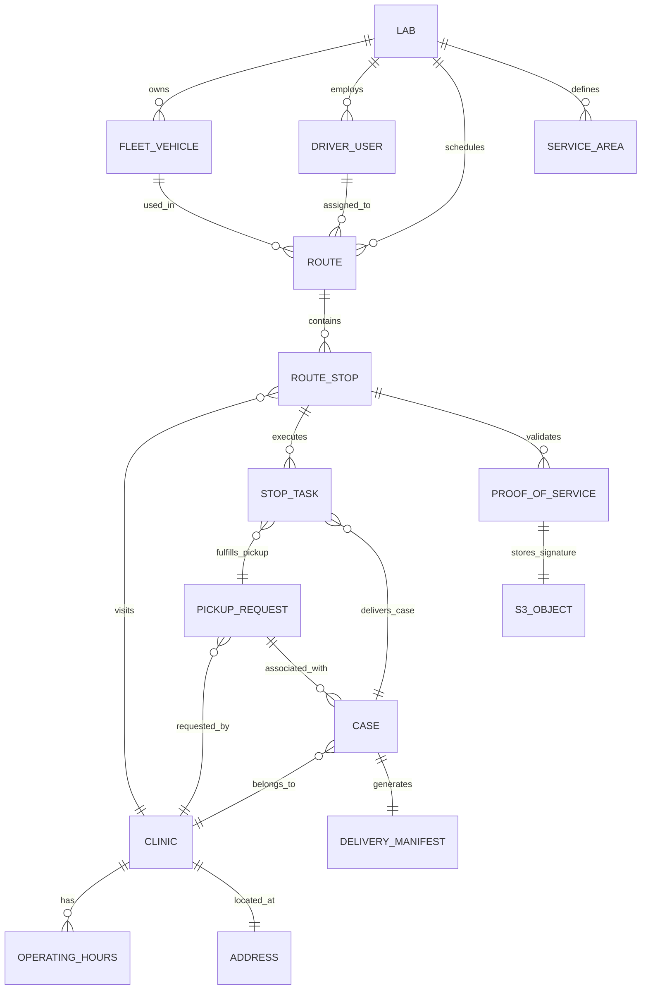
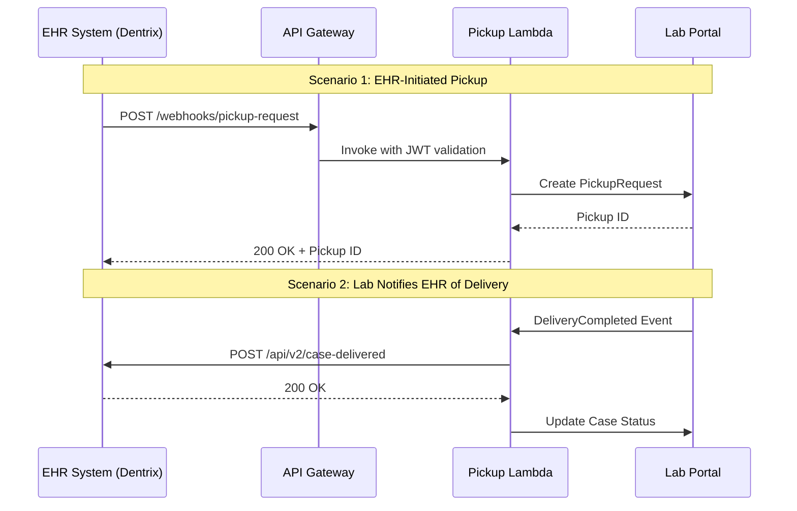

# Lab Portal - Logistics Domain Technical & UX Analysis
**Enterprise Architecture Document**  
**Date:** November 29, 2025  
**Version:** 1.0  
**Author:** Enterprise Architecture Team

---

## Executive Summary

The **Logistics Domain** serves as the physical backbone of the Dental Lab Portal, bridging digital workflows (CAD/CAM) with the physical reality of clinical dentistry (impressions, models, final prosthetics). Unlike standard e-commerce shipping, dental logistics demands:

- **Bi-directional workflows** (Pickups & Deliveries)
- **Strict Chain of Custody** (HIPAA compliance for physical assets)
- **Time-Window constraints** (aligned with clinic operating hours)
- **Same-day delivery requirements** (time-sensitive materials like alginate impressions)
- **Multi-tenant isolation** (lab-scoped access, clinic-specific data segregation)

This document evaluates the current React/Context implementation and defines a production-grade architecture for a scalable, AWS-hosted distributed system.

### Key Findings

- ✅ **Strengths:** Clean separation of concerns, role-based views, sequential stop enforcement
- ⚠️ **Critical Gaps:** Missing geolocation data, no recurring pickups, weak chain-of-custody tracking
- 🔧 **Recommendations:** Implement geohashing, normalize stop entities, add proof-of-service validation

---

## Table of Contents

1. [Logistics Mock Data Audit](#1-logistics-mock-data-audit)
2. [Entity & Relationship Mapping](#2-entity--relationship-mapping)
3. [Core Logistics Architecture](#3-core-logistics-architecture)
4. [Logistics Context Deep-Dive](#4-logistics-context-deep-dive)
5. [AWS Deployment Architecture](#5-aws-deployment-architecture)
6. [Integration Points & Event Flows](#6-integration-points--event-flows)
7. [Security & Compliance](#7-security--compliance)
8. [Performance & Scalability](#8-performance--scalability)
9. [Missing Elements & Gaps](#9-missing-elements--gaps)
10. [Implementation Roadmap](#10-implementation-roadmap)

---

## 1. Logistics Mock Data Audit

### 1.1 Current Implementation Overview

**Files Analyzed:**
- `/src/_mock/data/logistics/pickups.json` (4 pickup requests)
- `/src/_mock/data/logistics/routes.json` (1 route with 3 stops)
- `/src/contexts/LogisticsContext.jsx` (State management)

### 1.2 pickups.json Analysis

**Current Schema:**
```typescript
interface PickupRequest {
  id: string;
  labId: string;
  clinicId: string;
  requestedBy: string;          // Doctor/Staff ID
  requestTime: ISO8601;
  windowStart: ISO8601;
  windowEnd: ISO8601;
  status: 'Pending' | 'Assigned' | 'Completed';
  driverId: string | null;
  notes: string;                // ⚠️ Unstructured
  packageCount: number;
  isRush: boolean;
}
```

**Critical Gaps & Risks:**

| Issue | Impact | Priority | Recommendation |
|-------|--------|----------|----------------|
| **Missing Physical Specs** | No `weight` or `dimensions` fields. Bulk pickups (50+ stone models) require van capacity planning vs. scooter/bike couriers. | HIGH | Add `packageSpecs: { weight?: number, dimensions?: string, fragile?: boolean }` |
| **No Recurring Pickups** | High-volume clinics need "Every Tue/Thu at 2 PM" schedules. Current model is one-off only. | MEDIUM | Add `recurrenceRule?: { frequency: 'DAILY'\|'WEEKLY', interval: number, daysOfWeek?: number[] }` |
| **Weak Case Linkage** | `notes` contains unstructured data ("Rush case for patient Brown"). Breaks digital thread. | **CRITICAL** | Add `associatedCaseIds: string[]` for traceability |
| **No Chain of Custody** | No `custodyHandoffToken` or QR code validation. Cannot prove driver visited location. | **CRITICAL** | Add `verificationCode: string, scanTimestamp?: ISO8601, geoHash?: string` |
| **Missing SLA Tracking** | No `expectedPickupTime` separate from `windowEnd`. Cannot measure driver performance. | MEDIUM | Add `slaMetrics: { expectedArrival: ISO8601, actualArrival?: ISO8601, variance?: number }` |

**Sample Issue:**
```json
// Current (pickup-903)
{
  "notes": "Fragile PVS impressions for Gold Crowns. Please handle with care. Security Code: #9988."
}

// Should be:
{
  "associatedCaseIds": ["case-5010", "case-5011"],
  "packageSpecs": { "fragile": true, "packageType": "PVS Impression" },
  "accessInstructions": { "securityCode": "#9988", "entrance": "Suite 500" },
  "specialHandling": ["KEEP_LEVEL", "TEMPERATURE_SENSITIVE"]
}
```

### 1.3 routes.json Analysis

**Current Schema:**
```typescript
interface Route {
  id: string;
  labId: string;
  name: string;
  driverId: string;
  vehicleId: string;
  date: string;
  status: 'Scheduled' | 'InProgress' | 'Completed';
  startTime: ISO8601;
  endTime: ISO8601 | null;
  stops: Stop[];              // ⚠️ Nested array
}

interface Stop {
  id: string;
  sequence: number;
  clinicId: string;
  type: 'Pickup' | 'Delivery';
  status: 'Pending' | 'InProgress' | 'Completed';
  deliveryManifest?: DeliveryItem[];
  pickupTasks?: PickupTask[];
  completedAt?: ISO8601;
  signatureUrl?: string;
  signedBy?: string;
  estimatedArrival?: ISO8601;
  driverInstructions?: string;
}
```

**Critical Gaps & Risks:**

| Issue | Impact | Priority | Recommendation |
|-------|--------|----------|----------------|
| **Geolocation Void** | Stops reference `clinicId` but lack `lat`/`lng`. Route optimization and ETA calculation impossible. | **CRITICAL** | Denormalize clinic coordinates into Stop or compute on-the-fly via geocoding |
| **Concurrency Conflicts** | Nested `stops[]` array causes write conflicts when Dispatcher reorders while Driver updates status. | **CRITICAL** | Normalize Stops into separate DynamoDB table with `routeId` as GSI |
| **No Vehicle Metadata** | `vehicleId` is a string with no linked capabilities (capacity, secure lockbox, refrigeration). | MEDIUM | Create `FleetVehicle` entity with `specs: { capacity: number, features: string[] }` |
| **Missing Route Metrics** | No `totalDistance`, `estimatedDuration`, or `fuelCost` calculation. | LOW | Add `metrics: { distanceKm: number, durationMin: number, stopsCompleted: number }` |
| **No Deviation Tracking** | Cannot detect if driver went off-route or made unauthorized stops. | MEDIUM | Add `actualPath: GeoPoint[], deviations: Deviation[]` |

**Concurrency Example:**
```typescript
// Problem: Both operations modify the same Route document
// Dispatcher: Reorders stops 2 & 3
await updateRoute(routeId, { stops: reorderedStops });

// Driver (simultaneous): Marks stop 2 complete
await updateRoute(routeId, { 
  stops: route.stops.map(s => s.id === stopId ? {...s, status: 'Completed'} : s) 
});
// ❌ Last write wins, one operation is lost
```

**Solution: Normalize Stops**
```typescript
// Separate table: RouteStops
await updateRouteStop(stopId, { status: 'Completed' });
await updateRouteStop(stopId, { sequence: 3 }); // No conflict
```

### 1.4 Data Integrity Issues

**Missing Relationships:**
1. **Pickup → Case:** No foreign key to track which cases are in each pickup
2. **Stop → Address:** Clinic address changes aren't reflected in historical stops
3. **Route → Driver Performance:** No link to driver ratings or incident reports

**Redundant Data:**
```json
// stops[0].deliveryManifest contains duplicate case data
{
  "caseId": "case-5003",
  "description": "Implant Crown Box"  // ⚠️ Already in Case entity
}
```

**Recommended Normalization:**
```typescript
interface Stop {
  clinicSnapshot: {
    name: string;
    address: Address;      // Frozen at route creation time
    coordinates: GeoPoint;
  };
  tasks: TaskReference[]; // Just IDs, resolve via join
}
```

## 2. Entity & Relationship Mapping

### 2.1 Domain Object Graph



### 2.2 Cross-Domain Relationships

#### 2.2.1 Logistics ↔ Cases
```typescript
// Production → Logistics (Ready to Ship)
interface CaseDeliveryEvent {
  eventType: 'CaseReadyToShip';
  payload: {
    caseId: string;
    clinicId: string;
    packageSpecs: {
      itemType: 'Final Restoration' | 'Try-In' | 'Model';
      requiresSignature: boolean;
      fragile: boolean;
    };
    priority: 'STANDARD' | 'RUSH' | 'EMERGENCY';
    requestedDeliveryDate: string; // YYYY-MM-DD
  };
}

// Logistics creates DeliveryTask
const task = await createDeliveryTask({
  caseId: event.payload.caseId,
  status: 'Unassigned',
  // Validates clinic address exists
  destinationClinicId: event.payload.clinicId,
});
```

#### 2.2.2 Logistics ↔ CRM
```typescript
// Clinic → Logistics (Pickup Request)
interface PickupRequestEvent {
  eventType: 'PickupRequested';
  payload: {
    clinicId: string;
    requestedBy: string; // Doctor/Staff user ID
    windowStart: ISO8601;
    windowEnd: ISO8601;
    // Validated against Clinic.operatingHours
  };
}

// Validation logic
const clinic = await getClinic(clinicId);
const isValid = validateTimeWindow(
  windowStart, 
  windowEnd, 
  clinic.operatingHours
);
if (!isValid) throw new Error('Pickup window outside operating hours');
```

#### 2.2.3 Logistics ↔ Finance
```typescript
// Logistics → Finance (Delivery Confirmation)
interface DeliveryCompletedEvent {
  eventType: 'DeliveryCompleted';
  payload: {
    caseId: string;
    deliveredAt: ISO8601;
    signedBy: string;
    proofOfDelivery: {
      signatureUrl: string;
      photoUrl?: string;
    };
  };
}

// Finance listener updates invoice
await updateInvoice(invoice.id, {
  status: 'Sent',  // Triggers email to clinic
  deliveryConfirmedAt: event.payload.deliveredAt,
});
```

#### 2.2.4 Logistics ↔ EHR Integration
```typescript
// External EHR → Lab Portal (via webhook)
interface EHRPickupWebhook {
  source: 'DentrixAscend_V2' | 'OpenDental' | 'Eaglesoft';
  tenantId: string;
  event: {
    type: 'LabPickupRequested';
    clinicId: string; // Mapped via integration.tenantId
    patientId: string; // External patient ID
    notes: string;
    urgency: 'routine' | 'urgent';
  };
}

// Lab Portal creates PickupRequest
const clinic = await findClinicByTenantId(webhook.tenantId);
await createPickupRequest({
  clinicId: clinic.id,
  externalReference: {
    ehrSystem: webhook.source,
    patientId: webhook.event.patientId,
  },
  isRush: webhook.event.urgency === 'urgent',
});
```

### 2.3 Lifecycle State Machines

#### Pickup Request Lifecycle
```
┌─────────────┐
│   Pending   │ ◄── Created by clinic/EHR
└──────┬──────┘
       │ Dispatcher assigns to route
       ▼
┌─────────────┐
│  Assigned   │
└──────┬──────┘
       │ Driver starts stop
       ▼
┌─────────────┐
│  EnRoute    │ ◄── GPS tracking active
└──────┬──────┘
       │ Driver arrives
       ▼
┌─────────────┐
│  Arrived    │
└──────┬──────┘
       │ Package scanned/signed
       ▼
┌─────────────┐     ┌──────────────┐
│  Completed  │ OR  │   Skipped    │ (Clinic closed)
└─────────────┘     └──────────────┘
                           │
                           ▼
                    ┌──────────────┐
                    │ Rescheduled  │
                    └──────────────┘
```

#### Route Stop Status Flow
```
Pending → InProgress → (Arrived) → Completed
   │                                    │
   └──────────► Skipped ────────────────┘
                  │
                  └──► Requires manual intervention
```

## 3. Core Logistics Architecture

### 3.1 Domain Submodules

#### 3.1.1 Dispatch Console (RoutePlanner UI)

**Function:** Interactive route management and optimization  
**Users:** Logistics Admin, Lab Manager  
**Current Implementation:** `/src/components/logistics/RoutePlanner.jsx`

**Features:**
- ✅ Unassigned task pool (pickups + deliveries)
- ✅ Drag-and-drop assignment to routes
- ✅ Manual route creation
- ⚠️ **Missing:** Map visualization (Google Maps/Mapbox integration)
- ⚠️ **Missing:** Automatic route optimization
- ⚠️ **Missing:** Real-time driver location overlay

**UX Requirements:**
```typescript
interface DispatchConsoleFeatures {
  // Map View
  interactiveMap: {
    provider: 'GoogleMaps' | 'Mapbox';
    layers: ['Routes', 'ActiveDrivers', 'Clinics', 'TrafficOverlay'];
    clustering: boolean; // Group nearby stops
  };
  
  // Task Pool
  unassignedTasks: {
    filters: ['RUSH', 'TODAY', 'TOMORROW', 'FRAGILE'];
    sorting: ['PRIORITY' | 'CLINIC' | 'DEADLINE'];
    bulkActions: boolean; // Select multiple, assign to one route
  };
  
  // Route Optimization
  autoOptimize: {
    algorithm: 'NEAREST_NEIGHBOR' | 'TRAVELING_SALESMAN' | 'TIME_WINDOWS';
    respectTimeWindows: boolean;
    minimizeDistance: boolean;
  };
}
```

**Technical Stack:**
- **Frontend:** React + Mapbox GL JS
- **Routing Engine:** AWS Location Service (Amazon Location Routes API)
- **State Management:** Redux Toolkit (for complex drag-and-drop state)

#### 3.1.2 Driver Interface (DriverManifest UI)

**Function:** Mobile-first execution tool  
**Users:** Driver (role-driver)  
**Current Implementation:** `/src/components/logistics/DriverManifest.jsx`

**Features:**
- ✅ Sequential stop workflow (enforces order)
- ✅ Start/Complete actions
- ✅ Progress tracking
- ⚠️ **Missing:** Real signature capture (currently placeholder)
- ⚠️ **Missing:** Camera integration for proof-of-delivery photos
- ⚠️ **Missing:** Offline mode support
- ⚠️ **Missing:** Turn-by-turn navigation launch

**UX Requirements:**
```typescript
interface DriverManifestFeatures {
  // Mobile-Optimized UI
  responsiveDesign: {
    largeButtons: true;        // Tap targets >44px
    darkMode: boolean;         // For nighttime deliveries
    voicePrompts: boolean;     // "Next stop: Downtown Dental"
  };
  
  // Stop Actions
  stopWorkflow: {
    preArrival: ['CALL_CLINIC', 'VIEW_INSTRUCTIONS'];
    onSite: ['SCAN_QR', 'CAPTURE_SIGNATURE', 'TAKE_PHOTO'];
    exceptions: ['CLINIC_CLOSED', 'WRONG_ADDRESS', 'REFUSED_DELIVERY'];
  };
  
  // Offline Support
  offlineMode: {
    cacheManifest: boolean;    // IndexedDB storage
    queueActions: boolean;     // Sync when online
    criticalDataOnly: boolean; // Photos upload later
  };
  
  // Navigation
  navigationIntegration: {
    launchGoogleMaps: (address: Address) => void;
    launchWaze: (address: Address) => void;
    inAppNavigation: boolean; // Future enhancement
  };
}
```

**Technical Stack:**
- **Frontend:** PWA (Progressive Web App) for offline support
- **Signature:** `react-signature-canvas` library
- **Camera:** HTML5 Media Capture API
- **Storage:** IndexedDB for offline manifest caching

#### 3.1.3 Client Portal (PickupFormModal)

**Function:** Self-service pickup request  
**Users:** Clinic Staff (via portal login or EHR integration)  
**Current Implementation:** `/src/components/logistics/PickupFormModal.jsx`

**Features:**
- ✅ Clinic selection
- ✅ Time window picker
- ✅ Package count input
- ✅ Rush toggle
- ⚠️ **Missing:** Recurring pickup scheduling
- ⚠️ **Missing:** Live ETA tracking ("Driver arriving in 15 minutes")
- ⚠️ **Missing:** Historical pickup log

**UX Requirements:**
```typescript
interface ClientPortalFeatures {
  // Simplified Request Flow
  pickupRequest: {
    defaultTimeWindows: ['MORNING', 'AFTERNOON', 'END_OF_DAY'];
    recurringSchedule: {
      enabled: boolean;
      pattern: 'DAILY' | 'WEEKLY' | 'BIWEEKLY';
      daysOfWeek: number[]; // [2, 4] = Tue, Thu
    };
  };
  
  // Real-Time Tracking
  tracking: {
    showDriverLocation: boolean; // Only when en route
    estimatedArrival: ISO8601;
    notifications: ['SMS', 'EMAIL', 'PUSH'];
  };
  
  // History & Analytics
  dashboard: {
    upcomingPickups: PickupRequest[];
    completedHistory: number; // Last 30 days
    averageResponseTime: number; // Minutes
  };
}
```

### 3.2 Permission & Role Hierarchy

#### 3.2.1 Role Matrix

| Role | Permission Keys | Scope | Capabilities |
|------|----------------|-------|--------------|
| **Logistics Admin** | `LOGISTICS_MANAGE` | Lab-Wide | Create routes, override statuses, manage fleet, view all routes |
| **Dispatcher** | `LOGISTICS_DISPATCH` | Lab-Wide | Assign tasks to routes, optimize routes, communicate with drivers |
| **Driver** | `LOGISTICS_EXECUTE` | Own Routes | View assigned manifest, update stop status, capture signatures, report exceptions |
| **Lab Technician** | `LOGISTICS_VIEW` | Read-Only | Check arrival/departure status for cases |
| **Clinic Staff** | `PICKUP_REQUEST` | Own Clinic | Request pickups, view delivery ETA, access pickup history |
| **Clinic Admin** | `PICKUP_MANAGE` | Own Clinic | All clinic staff permissions + set recurring schedules |

#### 3.2.2 Access Control Rules

```typescript
// RBAC Implementation
const canAccessRoute = (user: User, route: Route): boolean => {
  // Admins see all
  if (user.hasPermission('ALL_ACCESS')) return true;
  
  // Drivers see only their assigned routes
  if (user.roleId === 'role-driver') {
    return route.driverId === user.id;
  }
  
  // Lab staff see routes for their lab
  if (user.hasPermission('LOGISTICS_VIEW')) {
    return route.labId === user.activeLab.id;
  }
  
  return false;
};

// Resource Scoping (Multi-Tenancy)
const getPickupsForClinic = async (clinicId: string, user: User) => {
  // Clinic users can only see their own pickups
  if (user.permissions.includes('PICKUP_REQUEST')) {
    const clinic = await getClinic(clinicId);
    if (!user.clinicIds.includes(clinicId)) {
      throw new ForbiddenError('Access denied to this clinic');
    }
  }
  
  return await db.pickups.where({ clinicId }).toArray();
};
```

### 3.3 Page & Component Boundaries

```
/logistics
├── /routes (LogisticsRoutes.jsx) ────────────────┐
│   ├── [View: planner] RoutePlanner.jsx          │ Requires LOGISTICS_DISPATCH
│   │   ├── UnassignedTaskPool                    │
│   │   ├── RouteColumns (per driver)             │
│   │   └── RouteOptimizationPanel                │
│   └── [View: manifest] DriverManifest.jsx       │ Requires LOGISTICS_EXECUTE
│       ├── RouteHeader (progress bar)            │
│       ├── StopTimeline                          │
│       └── StopActionModal (signature/photo)     │
├── PickupFormModal.jsx ──────────────────────────┤ Requires PICKUP_REQUEST
└── /analytics (Future)                           │
    ├── DriverPerformance.jsx                     │
    ├── SLACompliance.jsx                         │
    └── RouteEfficiency.jsx                       │
────────────────────────────────────────────────────┘
```

### 3.4 Integration Points with EHR

#### 3.4.1 Bidirectional Sync Architecture



#### 3.4.2 EHR Integration Requirements

**Supported Systems:**
- Dentrix Ascend (API v2.1)
- OpenDental (REST API)
- Eaglesoft (Patterson API)
- Curve Dental (WebHooks)

**Data Mapping:**
```typescript
interface EHRPickupMapping {
  // Dentrix Ascend
  dentrixAscend: {
    endpoint: '/api/v2/lab-orders/pickup-request';
    authentication: 'OAuth2';
    mapping: {
      patientId: 'patient_id',
      appointmentId: 'appointment_id',
      urgency: 'priority_level', // 1=STAT, 2=RUSH, 3=ROUTINE
    };
  };
  
  // OpenDental
  openDental: {
    endpoint: '/api/lab-cases/request-pickup';
    authentication: 'APIKey';
    mapping: {
      patientId: 'PatNum',
      labCaseId: 'LabCaseNum',
      instructions: 'LabInstructions',
    };
  };
}
```

## 4. Logistics Context Deep-Dive

### 4.1 Enhanced Data Models (Backend)

#### 4.1.1 Route Entity

```typescript
interface Route {
  // Identity
  id: string;
  labId: string;
  routeNumber: string;           // Human-readable: "R-2025-1120-A"
  
  // Assignment
  driverId: string;
  vehicleId: string;
  dispatcherId?: string;         // Who created the route
  
  // Temporal
  date: string;                  // YYYY-MM-DD
  scheduledStart: ISO8601;
  scheduledEnd: ISO8601;
  actualStart?: ISO8601;
  actualEnd?: ISO8601;
  
  // Status
  status: 'Draft' | 'Published' | 'Active' | 'Completed' | 'Cancelled';
  
  // Metrics (computed)
  metrics: {
    totalStops: number;
    completedStops: number;
    distanceKm: number;          // Sum of all leg distances
    estimatedDurationMin: number;
    actualDurationMin?: number;
    fuelEstimateUSD?: number;
  };
  
  // Audit
  createdAt: ISO8601;
  updatedAt: ISO8601;
  createdBy: string;
  
  // Version control (for optimistic locking)
  version: number;
}
```

#### 4.1.2 RouteStop Entity (Normalized)

```typescript
interface RouteStop {
  // Identity
  id: string;
  routeId: string;
  
  // Sequencing
  sequence: number;              // 1, 2, 3...
  legDistanceKm?: number;        // Distance from previous stop
  
  // Location (denormalized for performance)
  clinicId: string;
  clinicSnapshot: {              // Frozen at route creation
    name: string;
    address: Address;
    coordinates: GeoPoint;
    phone: string;
    operatingHours: OperatingHours;
  };
  
  // Classification
  type: 'Pickup' | 'Delivery' | 'Mixed';
  
  // Status
  status: 'Pending' | 'EnRoute' | 'Arrived' | 'Completed' | 'Skipped' | 'Failed';
  
  // Tasks (what to do at this stop)
  tasks: StopTask[];
  
  // Timing
  estimatedArrival: ISO8601;
  actualArrival?: ISO8601;
  estimatedDeparture: ISO8601;
  actualDeparture?: ISO8601;
  dwellTimeMin?: number;         // Time spent at stop
  
  // Driver Notes
  driverInstructions?: string;   // "Park in rear loading zone B"
  driverNotes?: string;          // Entered during execution
  
  // Proof of Service
  proofOfService?: ProofOfService;
  
  // Exceptions
  exceptions?: Exception[];
  
  // Audit
  updatedAt: ISO8601;
  updatedBy: string;
}

interface StopTask {
  id: string;
  type: 'CaseDelivery' | 'PickupRequest' | 'EquipmentReturn';
  referenceId: string;           // caseId, pickupId, etc.
  status: 'Pending' | 'Completed' | 'Failed';
  metadata: {
    packageCount?: number;
    fragile?: boolean;
    requiresSignature?: boolean;
    specialHandling?: string[];
  };
}

interface ProofOfService {
  signedBy: string;              // Name entered by recipient
  signature: {
    imageUrl: string;            // S3 path: s3://bucket/signatures/{stopId}.png
    capturedAt: ISO8601;
  };
  photo?: {
    imageUrl: string;            // S3 path: s3://bucket/deliveries/{stopId}.jpg
    capturedAt: ISO8601;
  };
  geoLocation: {
    lat: number;
    lng: number;
    accuracy: number;            // Meters
    geoHash: string;             // For validation
  };
  deviceInfo: {
    userAgent: string;
    appVersion: string;
  };
}

interface Exception {
  type: 'CLINIC_CLOSED' | 'WRONG_ADDRESS' | 'REFUSED_DELIVERY' | 'PACKAGE_DAMAGED' | 'OTHER';
  reportedAt: ISO8601;
  reportedBy: string;            // Driver ID
  notes: string;
  resolution?: {
    action: 'RESCHEDULED' | 'RETURNED_TO_LAB' | 'LEFT_AT_DOOR' | 'OTHER';
    resolvedAt: ISO8601;
    resolvedBy: string;
  };
}
```

#### 4.1.3 PickupRequest Entity (Enhanced)

```typescript
interface PickupRequest {
  // Identity
  id: string;
  labId: string;
  requestNumber: string;         // "PU-2025-1120-001"
  
  // Source
  clinicId: string;
  requestedBy: string;           // User ID (doctor/staff)
  requestTime: ISO8601;
  
  // Scheduling
  windowStart: ISO8601;
  windowEnd: ISO8601;
  preferredTime?: ISO8601;       // Clinic's ideal time
  
  // Status
  status: 'Pending' | 'Assigned' | 'EnRoute' | 'Completed' | 'Cancelled' | 'Rescheduled';
  
  // Assignment
  assignedRouteId?: string;
  assignedStopId?: string;
  assignedDriverId?: string;
  
  // Package Details
  packageCount: number;
  packageSpecs?: {
    weight?: number;             // Kilograms
    dimensions?: string;         // "12x8x6 cm"
    fragile: boolean;
    temperatureSensitive: boolean;
  };
  
  // Case Association
  associatedCaseIds: string[];   // Links to digital records
  
  // Priority
  isRush: boolean;
  priority: 'LOW' | 'NORMAL' | 'HIGH' | 'URGENT';
  
  // Instructions
  notes?: string;
  accessInstructions?: {
    buildingCode?: string;
    parkingInfo?: string;
    contactPerson?: string;
    contactPhone?: string;
  };
  
  // Verification (Chain of Custody)
  verificationCode: string;      // QR code data
  scanTimestamp?: ISO8601;
  scannedBy?: string;
  
  // SLA Tracking
  sla: {
    expectedPickupTime: ISO8601;
    actualPickupTime?: ISO8601;
    varianceMinutes?: number;
    breached: boolean;
  };
  
  // Recurrence
  recurrence?: {
    enabled: boolean;
    frequency: 'DAILY' | 'WEEKLY' | 'BIWEEKLY' | 'MONTHLY';
    interval: number;            // Every N days/weeks
    daysOfWeek?: number[];       // [1,3,5] = Mon, Wed, Fri
    endDate?: string;            // YYYY-MM-DD
  };
  
  // EHR Integration
  externalReference?: {
    ehrSystem: string;           // "DentrixAscend_V2"
    externalId: string;
    patientId?: string;
  };
  
  // Audit
  createdAt: ISO8601;
  updatedAt: ISO8601;
  cancelledAt?: ISO8601;
  cancellationReason?: string;
}
```

#### 4.1.4 FleetVehicle Entity (New)

```typescript
interface FleetVehicle {
  id: string;
  labId: string;
  
  // Vehicle Info
  make: string;                  // "Ford"
  model: string;                 // "Transit Connect"
  year: number;                  // 2024
  licensePlate: string;
  vin: string;
  
  // Type & Capacity
  type: 'Van' | 'Car' | 'Truck' | 'Bike' | 'Scooter';
  capacity: {
    volumeCubicFeet: number;
    weightKg: number;
    packageSlots: number;        // Max simultaneous packages
  };
  
  // Features
  features: string[];            // ["GPS_TRACKING", "SECURE_LOCKBOX", "CLIMATE_CONTROL"]
  
  // Status
  status: 'Active' | 'Maintenance' | 'Retired';
  
  // Maintenance
  maintenance: {
    lastService: string;         // YYYY-MM-DD
    nextService: string;
    mileage: number;
    oilChangeAt: number;
  };
  
  // Insurance
  insurance: {
    provider: string;
    policyNumber: string;
    expiresAt: string;           // YYYY-MM-DD
  };
  
  // Tracking
  gpsDeviceId?: string;
  currentLocation?: GeoPoint;
  lastLocationUpdate?: ISO8601;
}
```

### 4.2 Frontend State Management

#### 4.2.1 Current LogisticsContext Analysis

**Strengths:**
- ✅ Clean separation from other contexts
- ✅ Derived selectors (`myRoutes`)
- ✅ Optimistic updates with error handling

**Weaknesses:**
- ❌ **No pagination:** Route list grows indefinitely
- ❌ **Missing filters:** Cannot filter by date, status, driver
- ❌ **Poor scalability:** Loading all routes on mount (100+ routes = slow)
- ❌ **No caching:** Re-fetches data on every mount

#### 4.2.2 Enhanced State Structure (Redux Toolkit)

```typescript
// Slice: logistics/routesSlice.ts
interface RoutesState {
  // Normalized data (by ID)
  entities: Record<string, Route>;
  ids: string[];
  
  // UI State
  selectedRouteId: string | null;
  filters: {
    date: string;                // YYYY-MM-DD
    status: RouteStatus[];
    driverId: string | null;
  };
  sorting: {
    field: 'scheduledStart' | 'driverId' | 'status';
    order: 'asc' | 'desc';
  };
  
  // Pagination
  pagination: {
    page: number;
    pageSize: number;
    totalCount: number;
  };
  
  // Network State
  loading: boolean;
  error: string | null;
  lastFetch: ISO8601 | null;
  
  // Optimistic Updates
  pendingUpdates: Record<string, Partial<Route>>;
}

// Selectors (memoized with Reselect)
const selectFilteredRoutes = createSelector(
  [selectAllRoutes, selectFilters],
  (routes, filters) => {
    return routes.filter(route => {
      if (filters.date && route.date !== filters.date) return false;
      if (filters.status.length && !filters.status.includes(route.status)) return false;
      if (filters.driverId && route.driverId !== filters.driverId) return false;
      return true;
    });
  }
);

// Async Thunks
export const fetchRoutes = createAsyncThunk(
  'routes/fetchByDate',
  async ({ date, labId }: { date: string; labId: string }) => {
    const response = await api.get(`/logistics/routes`, {
      params: { date, labId }
    });
    return response.data;
  }
);

export const updateStopStatus = createAsyncThunk(
  'routes/updateStopStatus',
  async ({ routeId, stopId, status, proof }: UpdateStopPayload, { rejectWithValue }) => {
    try {
      // Optimistic update happens in pending case
      const response = await api.patch(`/logistics/stops/${stopId}`, {
        status,
        proofOfService: proof,
      });
      return response.data;
    } catch (err) {
      return rejectWithValue(err.response.data);
    }
  }
);
```

#### 4.2.3 Real-Time Updates (WebSocket)

```typescript
// hooks/useLogisticsWebSocket.ts
export const useLogisticsWebSocket = (labId: string) => {
  const dispatch = useDispatch();
  const ws = useRef<WebSocket | null>(null);

  useEffect(() => {
    // Connect to API Gateway WebSocket
    ws.current = new WebSocket(
      `${WS_URL}?labId=${labId}&token=${getAuthToken()}`
    );

    ws.current.onmessage = (event) => {
      const message = JSON.parse(event.data);
      
      switch (message.type) {
        case 'ROUTE_UPDATED':
          dispatch(routesSlice.actions.routeUpdated(message.payload));
          break;
        
        case 'STOP_STATUS_CHANGED':
          dispatch(routesSlice.actions.stopStatusChanged(message.payload));
          break;
        
        case 'DRIVER_LOCATION_UPDATED':
          dispatch(driversSlice.actions.locationUpdated(message.payload));
          break;
        
        case 'PICKUP_REQUEST_CREATED':
          dispatch(pickupsSlice.actions.pickupAdded(message.payload));
          showNotification('New pickup request received');
          break;
      }
    };

    return () => ws.current?.close();
  }, [labId, dispatch]);
};
```

### 4.3 Backend Workflow Lifecycles

#### 4.3.1 End-to-End Delivery Workflow

```
┌──────────────────────────────────────────────────────────────┐
│  PHASE 1: CASE COMPLETION (Production Domain)               │
└──────────────────────────────────────────────────────────────┘
  Case Status: QC Passed → Ready to Ship
  ↓
  EventBridge publishes: CaseReadyToShip
  ↓
┌──────────────────────────────────────────────────────────────┐
│  PHASE 2: DELIVERY TASK CREATION (Logistics Domain)         │
└──────────────────────────────────────────────────────────────┘
  Lambda: CreateDeliveryTask
  ↓
  - Validates clinic address
  - Checks delivery preferences (UPS vs. Lab Courier)
  - Creates DeliveryTask with status=Unassigned
  - Publishes: DeliveryTaskCreated
  ↓
┌──────────────────────────────────────────────────────────────┐
│  PHASE 3: ROUTE PLANNING (Dispatch Console)                 │
└──────────────────────────────────────────────────────────────┘
  Dispatcher assigns task to Route
  ↓
  - Creates RouteStop (sequence=N, status=Pending)
  - Links DeliveryTask.stopId
  - Publishes: RouteStopAdded
  ↓
┌──────────────────────────────────────────────────────────────┐
│  PHASE 4: DRIVER EXECUTION (DriverManifest)                  │
└──────────────────────────────────────────────────────────────┘
  Stop Status: Pending → EnRoute → Arrived → Completed
  ↓
  1. Driver clicks "Start Stop"
     - GPS location captured
     - Status → EnRoute
     - WebSocket broadcasts to dispatch
  ↓
  2. Driver arrives at clinic
     - Status → Arrived
     - Clinic notified via SMS
  ↓
  3. Recipient signs on device
     - Signature uploaded to S3
     - Photo captured (optional)
     - Status → Completed
     - Publishes: DeliveryCompleted
  ↓
┌──────────────────────────────────────────────────────────────┐
│  PHASE 5: POST-DELIVERY (Finance + Cases)                    │
└──────────────────────────────────────────────────────────────┘
  EventBridge routes DeliveryCompleted to:
  ↓
  1. Finance Service:
     - Invoice status: Draft → Sent
     - Email invoice to clinic
  ↓
  2. Cases Service:
     - Case status: Ready to Ship → Delivered
     - Timestamp recorded
  ↓
  3. CRM Service:
     - Notification sent to doctor
```

#### 4.3.2 Exception Handling Workflow

**Scenario: Clinic Closed During Pickup**

```typescript
// Step 1: Driver reports exception
const exception: Exception = {
  type: 'CLINIC_CLOSED',
  reportedAt: new Date().toISOString(),
  reportedBy: driverId,
  notes: 'Arrived at 2:15 PM, office locked, no answer at door',
};

await updateStopStatus(stopId, 'Skipped', { exception });

// Step 2: System auto-triggers notifications
await Promise.all([
  // Notify dispatcher
  sendSlackMessage(DISPATCH_CHANNEL, {
    text: `🚨 Stop Skipped: ${clinic.name}`,
    stopId,
    driverId,
    reason: exception.type,
  }),
  
  // Notify clinic via email
  sendEmail({
    to: clinic.contacts.primary.email,
    subject: 'Missed Pickup Attempt',
    body: `Our driver attempted pickup at ${exception.reportedAt} but found the office closed.`,
  }),
  
  // Update PickupRequest
  updatePickupRequest(pickupId, {
    status: 'Rescheduled',
    notes: `Original attempt failed: ${exception.notes}`,
  }),
]);

// Step 3: Dispatcher reschedules
const newPickup = await createPickupRequest({
  clinicId: pickup.clinicId,
  windowStart: addDays(pickup.windowStart, 1),
  windowEnd: addDays(pickup.windowEnd, 1),
  parentRequestId: pickup.id, // Track relationship
});
```

### 4.4 Required Helper Utilities

#### 4.4.1 Time Window Validation

```typescript
// utils/logistics/timeWindowValidator.ts
export const validateTimeWindow = (
  windowStart: ISO8601,
  windowEnd: ISO8601,
  operatingHours: OperatingHours
): ValidationResult => {
  const start = parseISO(windowStart);
  const end = parseISO(windowEnd);
  const dayOfWeek = format(start, 'EEE'); // 'Mon', 'Tue', etc.
  
  const hoursForDay = operatingHours.schedule[dayOfWeek];
  
  if (!hoursForDay) {
    return {
      valid: false,
      reason: `Clinic closed on ${dayOfWeek}`,
    };
  }
  
  for (const range of hoursForDay) {
    const [openTime, closeTime] = range.split('-');
    const clinicOpen = parseISO(`${format(start, 'yyyy-MM-dd')}T${openTime}:00`);
    const clinicClose = parseISO(`${format(start, 'yyyy-MM-dd')}T${closeTime}:00`);
    
    if (start >= clinicOpen && end <= clinicClose) {
      return { valid: true };
    }
  }
  
  return {
    valid: false,
    reason: `Window ${format(start, 'HH:mm')}-${format(end, 'HH:mm')} outside operating hours`,
    suggestion: hoursForDay[0], // Suggest first available slot
  };
};
```

#### 4.4.2 Route Optimization

```typescript
// utils/logistics/routeOptimizer.ts
interface OptimizationInput {
  stops: RouteStop[];
  startLocation: GeoPoint;
  endLocation?: GeoPoint;
  algorithm: 'NEAREST_NEIGHBOR' | 'TIME_WINDOWS';
}

export const optimizeRoute = async (input: OptimizationInput): Promise<RouteStop[]> => {
  if (input.algorithm === 'NEAREST_NEIGHBOR') {
    return nearestNeighborTSP(input.stops, input.startLocation);
  }
  
  // Use AWS Location Service for production
  const response = await awsLocation.calculateRoute({
    DeparturePosition: [input.startLocation.lng, input.startLocation.lat],
    DestinationPosition: [input.endLocation.lng, input.endLocation.lat],
    WaypointPositions: input.stops.map(s => [
      s.clinicSnapshot.coordinates.lng,
      s.clinicSnapshot.coordinates.lat,
    ]),
    TravelMode: 'Car',
    OptimizeWaypointOrder: true,
  });
  
  // Reorder stops based on optimized waypoint indices
  return response.Legs.map((leg, index) => ({
    ...input.stops[leg.WaypointIndex],
    sequence: index + 1,
    legDistanceKm: leg.Distance,
  }));
};
```

#### 4.4.3 Distance & ETA Calculation

```typescript
// utils/logistics/distanceCalculator.ts
export const calculateDistance = (from: GeoPoint, to: GeoPoint): number => {
  // Haversine formula
  const R = 6371; // Earth radius in km
  const dLat = toRad(to.lat - from.lat);
  const dLng = toRad(to.lng - from.lng);
  
  const a = 
    Math.sin(dLat / 2) * Math.sin(dLat / 2) +
    Math.cos(toRad(from.lat)) * Math.cos(toRad(to.lat)) *
    Math.sin(dLng / 2) * Math.sin(dLng / 2);
  
  const c = 2 * Math.atan2(Math.sqrt(a), Math.sqrt(1 - a));
  return R * c;
};

export const estimateETA = (
  currentLocation: GeoPoint,
  destination: GeoPoint,
  trafficFactor: number = 1.2 // 20% buffer for traffic
): ISO8601 => {
  const distanceKm = calculateDistance(currentLocation, destination);
  const avgSpeedKph = 40; // Urban average
  const durationHours = (distanceKm / avgSpeedKph) * trafficFactor;
  
  return addHours(new Date(), durationHours).toISOString();
};
```

#### 4.4.4 Geohash Utilities

```typescript
// utils/logistics/geohash.ts
import geohash from 'ngeohash';

export const encodeLocation = (lat: number, lng: number, precision: number = 9): string => {
  return geohash.encode(lat, lng, precision);
};

export const decodeLocation = (hash: string): GeoPoint => {
  const { latitude, longitude } = geohash.decode(hash);
  return { lat: latitude, lng: longitude };
};

// Query nearby stops efficiently
export const getStopsNearDriver = async (
  driverLocation: GeoPoint,
  radiusKm: number = 5
): Promise<RouteStop[]> => {
  const hash = encodeLocation(driverLocation.lat, driverLocation.lng, 6);
  const neighbors = geohash.neighbors(hash);
  
  // Query DynamoDB using GSI on geoHash field
  const results = await db.query({
    IndexName: 'GeoHashIndex',
    KeyConditionExpression: 'geoHash IN (:hash, :neighbors)',
    ExpressionAttributeValues: {
      ':hash': hash,
      ':neighbors': neighbors,
    },
  });
  
  // Filter by exact distance
  return results.Items.filter(stop => {
    const distance = calculateDistance(driverLocation, stop.coordinates);
    return distance <= radiusKm;
  });
};
```

## 5. AWS Deployment Architecture

### 5.1 Infrastructure Components

#### 5.1.1 Compute Layer

**AWS Lambda Functions:**

```
logistics-api/
├── routes/
│   ├── createRoute.js          # POST /routes
│   ├── getRoutes.js            # GET /routes?date=YYYY-MM-DD
│   ├── updateRoute.js          # PATCH /routes/{id}
│   ├── optimizeRoute.js        # POST /routes/{id}/optimize
│   └── deleteRoute.js          # DELETE /routes/{id}
├── stops/
│   ├── updateStopStatus.js     # PATCH /stops/{id}
│   ├── getStopDetails.js       # GET /stops/{id}
│   └── uploadProof.js          # POST /stops/{id}/proof (handles S3 upload)
├── pickups/
│   ├── createPickup.js         # POST /pickups
│   ├── getPickups.js           # GET /pickups?clinicId=...
│   ├── assignPickup.js         # PATCH /pickups/{id}/assign
│   └── reschedulePickup.js     # POST /pickups/{id}/reschedule
├── drivers/
│   ├── getManifest.js          # GET /drivers/{id}/manifest?date=...
│   └── updateLocation.js       # POST /drivers/{id}/location (via WebSocket)
└── webhooks/
    ├── ehrPickupRequest.js     # POST /webhooks/ehr/pickup (from Dentrix, etc.)
    └── trafficUpdate.js        # POST /webhooks/traffic (from Google Maps)
```

**Configuration:**
```typescript
// Lambda Function Config (Terraform/CDK)
const createRouteLambda = new lambda.Function(this, 'CreateRoute', {
  runtime: lambda.Runtime.NODEJS_18_X,
  handler: 'index.handler',
  timeout: Duration.seconds(30),
  memorySize: 512,
  environment: {
    ROUTES_TABLE: routesTable.tableName,
    STOPS_TABLE: stopsTable.tableName,
    S3_BUCKET: proofBucket.bucketName,
    LOCATION_SERVICE_ARN: awsLocationService.arn,
  },
  layers: [
    geospatialLayer,  // Geohash, Turf.js for distance calc
    authLayer,        // Cognito verification
  ],
});

// Grant permissions
routesTable.grantReadWriteData(createRouteLambda);
proofBucket.grantWrite(uploadProofLambda);
```

#### 5.1.2 API Gateway

**REST API:**
```yaml
# OpenAPI 3.0 Specification
paths:
  /routes:
    get:
      summary: List routes
      parameters:
        - name: date
          in: query
          required: true
          schema:
            type: string
            format: date
        - name: labId
          in: query
          required: true
      responses:
        '200':
          description: Array of routes
          content:
            application/json:
              schema:
                $ref: '#/components/schemas/RouteList'
    post:
      summary: Create new route
      security:
        - CognitoAuthorizer: [LOGISTICS_MANAGE]
      requestBody:
        $ref: '#/components/schemas/CreateRouteRequest'
  
  /stops/{stopId}:
    patch:
      summary: Update stop status
      security:
        - CognitoAuthorizer: [LOGISTICS_EXECUTE]
      parameters:
        - name: stopId
          in: path
          required: true
      requestBody:
        content:
          application/json:
            schema:
              type: object
              properties:
                status:
                  type: string
                  enum: [Pending, EnRoute, Arrived, Completed, Skipped]
                proofOfService:
                  $ref: '#/components/schemas/ProofOfService'
```

**WebSocket API:**
```typescript
// WebSocket Connection Handler
export const connect = async (event: APIGatewayWebSocketEvent) => {
  const { connectionId } = event.requestContext;
  const { queryStringParameters } = event;
  
  // Validate JWT token
  const token = queryStringParameters.token;
  const user = await verifyToken(token);
  
  // Store connection mapping
  await db.put({
    TableName: 'WebSocketConnections',
    Item: {
      connectionId,
      userId: user.id,
      labId: user.labId,
      role: user.role,
      connectedAt: new Date().toISOString(),
      ttl: Math.floor(Date.now() / 1000) + 3600, // 1 hour expiry
    },
  });
  
  return { statusCode: 200, body: 'Connected' };
};

// Broadcast to all dispatchers in a lab
export const broadcastToDispatchers = async (labId: string, message: object) => {
  const connections = await db.query({
    TableName: 'WebSocketConnections',
    IndexName: 'LabIndex',
    KeyConditionExpression: 'labId = :labId',
    FilterExpression: '#role = :role',
    ExpressionAttributeValues: {
      ':labId': labId,
      ':role': 'role-admin', // Or LOGISTICS_MANAGE permission
    },
    ExpressionAttributeNames: {
      '#role': 'role',
    },
  });
  
  const apiGatewayManagementApi = new ApiGatewayManagementApi({
    endpoint: process.env.WS_ENDPOINT,
  });
  
  await Promise.all(
    connections.Items.map(conn =>
      apiGatewayManagementApi.postToConnection({
        ConnectionId: conn.connectionId,
        Data: JSON.stringify(message),
      }).promise().catch(err => {
        // Delete stale connection
        if (err.statusCode === 410) {
          db.delete({ TableName: 'WebSocketConnections', Key: { connectionId: conn.connectionId } });
        }
      })
    )
  );
};
```

#### 5.1.3 Database Layer (DynamoDB)

**Single-Table Design:**

```typescript
// Table: LogisticsData
// Primary Key: PK (Partition), SK (Sort)

interface TableSchema {
  // Routes
  'ROUTE#{date}#{labId}': {
    SK: 'ROUTE#{routeId}';
    GSI1PK: 'DRIVER#{driverId}';
    GSI1SK: 'DATE#{date}';
    GSI2PK: 'LAB#{labId}';
    GSI2SK: 'STATUS#{status}#DATE#{date}';
    // Route attributes...
  };
  
  // Stops (normalized)
  'STOP#{routeId}': {
    SK: 'STOP#{sequence}#{stopId}';
    GSI1PK: 'CLINIC#{clinicId}';
    GSI1SK: 'DATE#{date}';
    GSI2PK: 'GEOHASH#{geoHash6}'; // For proximity queries
    GSI2SK: 'TIMESTAMP#{estimatedArrival}';
    // Stop attributes...
  };
  
  // Pickup Requests
  'PICKUP#{clinicId}': {
    SK: 'REQUEST#{requestTime}#{pickupId}';
    GSI1PK: 'LAB#{labId}';
    GSI1SK: 'STATUS#{status}#TIME#{windowStart}';
    GSI2PK: 'DRIVER#{assignedDriverId}'; // When assigned
    GSI2SK: 'DATE#{date}';
    // Pickup attributes...
  };
}
```

**Access Patterns:**

| Query | Index | Condition |
|-------|-------|-----------|
| Get all routes for a lab on specific date | GSI2 | `GSI2PK = LAB#{labId}` AND `begins_with(GSI2SK, 'STATUS#DATE#{date}')` |
| Get driver's routes for today | GSI1 | `GSI1PK = DRIVER#{driverId}` AND `GSI1SK = DATE#{today}` |
| Find stops near location (5km radius) | GSI2 | `GSI2PK IN (geohash6 + neighbors)` |
| Get pickup history for clinic | Primary | `PK = PICKUP#{clinicId}` AND `begins_with(SK, 'REQUEST#')` |
| Get unassigned pickups for lab | GSI1 | `GSI1PK = LAB#{labId}` AND `begins_with(GSI1SK, 'STATUS#Pending')` |

**DynamoDB Streams Integration:**
```typescript
// Stream Handler: Publish events to EventBridge
export const streamHandler = async (event: DynamoDBStreamEvent) => {
  const records = event.Records.filter(r => r.eventName === 'MODIFY');
  
  for (const record of records) {
    const newImage = unmarshall(record.dynamodb.NewImage);
    const oldImage = unmarshall(record.dynamodb.OldImage);
    
    // Detect stop status change
    if (newImage.SK.startsWith('STOP#') && newImage.status !== oldImage.status) {
      await eventBridge.putEvents({
        Entries: [{
          Source: 'logistics.stops',
          DetailType: 'StopStatusChanged',
          Detail: JSON.stringify({
            stopId: newImage.id,
            routeId: newImage.routeId,
            oldStatus: oldImage.status,
            newStatus: newImage.status,
            timestamp: new Date().toISOString(),
          }),
        }],
      });
    }
  }
};
```

**Alternative: RDS Aurora Serverless (Relational Model)**

If complex joins and transactions are required:

```sql
-- Schema Design
CREATE TABLE routes (
  id UUID PRIMARY KEY,
  lab_id UUID NOT NULL REFERENCES labs(id),
  driver_id UUID NOT NULL REFERENCES users(id),
  route_number VARCHAR(50) UNIQUE,
  date DATE NOT NULL,
  status route_status NOT NULL,
  created_at TIMESTAMPTZ DEFAULT NOW(),
  INDEX idx_lab_date (lab_id, date),
  INDEX idx_driver_date (driver_id, date)
);

CREATE TABLE route_stops (
  id UUID PRIMARY KEY,
  route_id UUID NOT NULL REFERENCES routes(id) ON DELETE CASCADE,
  sequence INT NOT NULL,
  clinic_id UUID NOT NULL REFERENCES clinics(id),
  status stop_status NOT NULL,
  coordinates GEOGRAPHY(POINT, 4326), -- PostGIS for geospatial
  estimated_arrival TIMESTAMPTZ,
  actual_arrival TIMESTAMPTZ,
  UNIQUE (route_id, sequence)
);

-- Geospatial Query (find stops within 5km)
SELECT * FROM route_stops
WHERE ST_DWithin(
  coordinates,
  ST_MakePoint(-74.0060, 40.7128)::geography,
  5000 -- 5km radius in meters
)
AND date = CURRENT_DATE
ORDER BY ST_Distance(coordinates, ST_MakePoint(-74.0060, 40.7128)::geography);
```

**Recommendation:** Use **DynamoDB** for:
- High write throughput (drivers updating locations every 30s)
- Scan-free queries (hash-based lookups)
- Auto-scaling without operational overhead

Use **RDS** only if:
- Complex multi-table joins are unavoidable
- ACID transactions are critical
- Team has stronger SQL expertise

#### 5.1.4 Storage (Amazon S3)

**Bucket Structure:**
```
s3://lab-portal-logistics-{env}/
├── signatures/
│   ├── {stopId}/
│   │   ├── signature.png
│   │   └── metadata.json
├── delivery-photos/
│   ├── {stopId}/
│   │   ├── photo-{timestamp}.jpg
│   │   └── thumbnail.jpg
├── manifests/
│   ├── {routeId}/
│   │   ├── manifest.pdf
│   │   └── barcode-labels.pdf
└── qr-codes/
    ├── {pickupId}.svg
```

**Lifecycle Policies:**
```typescript
const bucket = new s3.Bucket(this, 'LogisticsBucket', {
  lifecycleRules: [
    {
      id: 'ArchiveOldSignatures',
      transitions: [{
        storageClass: s3.StorageClass.GLACIER,
        transitionAfter: Duration.days(90), // Compliance: 90 days hot, then cold
      }],
    },
    {
      id: 'DeleteOldPhotos',
      expiration: Duration.days(730), // 2 years retention
      prefix: 'delivery-photos/',
    },
  ],
  cors: [{
    allowedOrigins: ['https://portal.jslab.com'],
    allowedMethods: [s3.HttpMethods.PUT, s3.HttpMethods.POST],
    allowedHeaders: ['*'],
    maxAge: 3600,
  }],
});
```

**Pre-Signed URL for Upload:**
```typescript
// Lambda: Generate upload URL for driver
export const getUploadUrl = async (stopId: string, fileType: 'signature' | 'photo') => {
  const key = `${fileType}s/${stopId}/${fileType}-${Date.now()}.png`;
  
  const command = new PutObjectCommand({
    Bucket: process.env.S3_BUCKET,
    Key: key,
    ContentType: fileType === 'signature' ? 'image/png' : 'image/jpeg',
    Metadata: {
      stopId,
      uploadedBy: 'driver-app',
    },
  });
  
  const url = await getSignedUrl(s3Client, command, { expiresIn: 300 }); // 5 min
  
  return { uploadUrl: url, s3Key: key };
};
```

#### 5.1.5 Authentication (Cognito)

**User Pool Configuration:**
```typescript
const userPool = new cognito.UserPool(this, 'LogisticsUserPool', {
  customAttributes: {
    labId: new cognito.StringAttribute({ mutable: false }),
    roleId: new cognito.StringAttribute({ mutable: true }),
    driverLicense: new cognito.StringAttribute({ mutable: true }),
    vehicleId: new cognito.StringAttribute({ mutable: true }),
  },
  passwordPolicy: {
    minLength: 12,
    requireUppercase: true,
    requireDigits: true,
  },
  mfa: cognito.Mfa.OPTIONAL,
  mfaSecondFactor: { sms: true, otp: true },
});

// Lambda Authorizer for API Gateway
export const authorizer = async (event: APIGatewayAuthorizerEvent) => {
  const token = event.authorizationToken;
  
  try {
    const decoded = jwt.verify(token, COGNITO_PUBLIC_KEY);
    const permissions = await getPermissionsForRole(decoded['custom:roleId']);
    
    // Check if user can access this resource
    const resourcePermission = extractPermission(event.methodArn); // e.g., 'LOGISTICS_EXECUTE'
    
    if (!permissions.includes(resourcePermission) && !permissions.includes('ALL_ACCESS')) {
      throw new Error('Unauthorized');
    }
    
    return {
      principalId: decoded.sub,
      policyDocument: generatePolicy('Allow', event.methodArn),
      context: {
        userId: decoded.sub,
        labId: decoded['custom:labId'],
        roleId: decoded['custom:roleId'],
        permissions: JSON.stringify(permissions),
      },
    };
  } catch (err) {
    throw new Error('Unauthorized');
  }
};
```

### 5.2 Event-Driven Architecture (EventBridge)

#### 5.2.1 Event Bus Design

```typescript
// Event Bus: lab-portal-events
const eventBus = new events.EventBus(this, 'LabPortalEventBus', {
  eventBusName: 'lab-portal-events',
});

// Event Schemas
const schemas = {
  'CaseReadyToShip': {
    source: 'cases.production',
    detailType: 'CaseReadyToShip',
    detail: {
      caseId: 'string',
      labId: 'string',
      clinicId: 'string',
      packageSpecs: {
        weight: 'number',
        fragile: 'boolean',
      },
      priority: 'STANDARD | RUSH | EMERGENCY',
      requestedDeliveryDate: 'string',
    },
  },
  
  'DeliveryCompleted': {
    source: 'logistics.driver',
    detailType: 'DeliveryCompleted',
    detail: {
      stopId: 'string',
      routeId: 'string',
      caseIds: 'string[]',
      deliveredAt: 'string',
      signedBy: 'string',
      proofOfDelivery: {
        signatureUrl: 'string',
        photoUrl: 'string',
      },
    },
  },
  
  'PickupRequested': {
    source: 'logistics.portal',
    detailType: 'PickupRequested',
    detail: {
      pickupId: 'string',
      clinicId: 'string',
      labId: 'string',
      windowStart: 'string',
      windowEnd: 'string',
      isRush: 'boolean',
    },
  },
};
```

#### 5.2.2 Event Rules & Targets

```typescript
// Rule 1: Case Ready → Create Delivery Task
new events.Rule(this, 'CaseReadyRule', {
  eventBus,
  eventPattern: {
    source: ['cases.production'],
    detailType: ['CaseReadyToShip'],
  },
  targets: [
    new targets.LambdaFunction(createDeliveryTaskLambda),
    new targets.SqsQueue(deliveryQueue), // Buffer for batch processing
  ],
});

// Rule 2: Delivery Complete → Update Invoice & Case
new events.Rule(this, 'DeliveryCompleteRule', {
  eventBus,
  eventPattern: {
    source: ['logistics.driver'],
    detailType: ['DeliveryCompleted'],
  },
  targets: [
    new targets.LambdaFunction(updateInvoiceLambda),
    new targets.LambdaFunction(updateCaseStatusLambda),
    new targets.SnsTopic(clinicNotificationTopic), // SMS/Email
  ],
});

// Rule 3: Pickup Requested (RUSH) → Alert Dispatcher
new events.Rule(this, 'RushPickupRule', {
  eventBus,
  eventPattern: {
    source: ['logistics.portal', 'ehr.integration'],
    detailType: ['PickupRequested'],
    detail: {
      isRush: [true],
    },
  },
  targets: [
    new targets.LambdaFunction(sendSlackAlertLambda),
    new targets.LambdaFunction(sendSMSLambda), // To on-call dispatcher
  ],
});

// Rule 4: Stop Skipped → Reschedule Workflow
new events.Rule(this, 'StopSkippedRule', {
  eventBus,
  eventPattern: {
    source: ['logistics.stops'],
    detailType: ['StopStatusChanged'],
    detail: {
      newStatus: ['Skipped'],
    },
  },
  targets: [
    new targets.SfnStateMachine(rescheduleStateMachine), // Step Functions
    new targets.LambdaFunction(notifyClinicLambda),
  ],
});
```

### 5.3 Recommendations for Scale

#### 5.3.1 Geohashing Strategy

```typescript
// Store 6-character geohash for each stop
const geoHash6 = geohash.encode(clinic.lat, clinic.lng, 6); // ~1.2km precision

// DynamoDB GSI: GeoHashIndex
await db.put({
  TableName: 'RouteStops',
  Item: {
    ...stop,
    geoHash6,
    geoHash7: geohash.encode(clinic.lat, clinic.lng, 7), // ~150m precision
  },
});

// Query nearby stops (including 8 neighbors)
const neighbors = geohash.neighbors(currentHash6);
const queryKeys = [currentHash6, ...neighbors];

const nearbyStops = await Promise.all(
  queryKeys.map(hash =>
    db.query({
      IndexName: 'GeoHashIndex',
      KeyConditionExpression: 'geoHash6 = :hash',
      ExpressionAttributeValues: { ':hash': hash },
    })
  )
);
```

#### 5.3.2 Scan-Free Workflows

**Problem:** Traditional approach scans entire Routes table to find "active" routes.

**Solution:** Use GSI with composite sort key:

```typescript
// GSI: LabStatusDateIndex
// PK: LAB#{labId}
// SK: STATUS#{status}#DATE#{date}

// Query only active routes for today
const activeRoutes = await db.query({
  IndexName: 'LabStatusDateIndex',
  KeyConditionExpression: 'PK = :labId AND begins_with(SK, :prefix)',
  ExpressionAttributeValues: {
    ':labId': `LAB#${labId}`,
    ':prefix': `STATUS#Active#DATE#${today}`,
  },
});
```

#### 5.3.3 Offline Support Architecture

```typescript
// Service Worker (PWA)
self.addEventListener('fetch', (event) => {
  // Cache manifest data
  if (event.request.url.includes('/manifest')) {
    event.respondWith(
      caches.match(event.request).then(response => {
        return response || fetch(event.request).then(fetchResponse => {
          return caches.open('manifest-cache').then(cache => {
            cache.put(event.request, fetchResponse.clone());
            return fetchResponse;
          });
        });
      })
    );
  }
});

// IndexedDB for action queue
const db = await idb.openDB('logistics-offline', 1, {
  upgrade(db) {
    db.createObjectStore('pending-actions', { keyPath: 'id', autoIncrement: true });
  },
});

// Queue action when offline
export const updateStopOffline = async (stopId, status, proof) => {
  await db.add('pending-actions', {
    action: 'UPDATE_STOP_STATUS',
    payload: { stopId, status, proof },
    timestamp: Date.now(),
  });
};

// Sync when online
window.addEventListener('online', async () => {
  const pendingActions = await db.getAll('pending-actions');
  
  for (const action of pendingActions) {
    try {
      await syncAction(action);
      await db.delete('pending-actions', action.id);
    } catch (err) {
      console.error('Sync failed:', err);
    }
  }
});
```

### 5.4 Route Optimization Engine

**Do NOT build from scratch. Use managed services:**

```typescript
// Option 1: AWS Location Service
import { LocationClient, CalculateRouteCommand } from '@aws-sdk/client-location';

const client = new LocationClient({ region: 'us-east-1' });

export const optimizeRoute = async (stops: Stop[]) => {
  const command = new CalculateRouteCommand({
    CalculatorName: 'MyRouteCalculator',
    DeparturePosition: [labCoordinates.lng, labCoordinates.lat],
    DestinationPosition: [labCoordinates.lng, labCoordinates.lat], // Round trip
    WaypointPositions: stops.map(s => [s.coordinates.lng, s.coordinates.lat]),
    TravelMode: 'Car',
    OptimizeWaypointOrder: true,
    DepartNow: true, // Real-time traffic
  });
  
  const response = await client.send(command);
  
  return {
    optimizedStops: response.Legs.map((leg, i) => ({
      ...stops[leg.StartPosition], // Reorder based on optimal sequence
      sequence: i + 1,
      distance: leg.Distance,
      duration: leg.DurationSeconds,
    })),
    totalDistance: response.Summary.Distance,
    totalDuration: response.Summary.DurationSeconds,
  };
};

// Option 2: Google Routes API (if more mature features needed)
import { RoutesClient } from '@googlemaps/routing';

const routesClient = new RoutesClient();

export const optimizeWithGoogle = async (stops: Stop[]) => {
  const request = {
    origin: { location: { latLng: labCoordinates } },
    destination: { location: { latLng: labCoordinates } },
    intermediates: stops.map(s => ({ location: { latLng: s.coordinates } })),
    travelMode: 'DRIVE',
    optimizeWaypointOrder: true,
    routingPreference: 'TRAFFIC_AWARE',
  };
  
  const [response] = await routesClient.computeRoutes(request);
  return response;
};
```

---

## 6. Integration Points & Cross-Domain Event Flows

### 6.1 Production → Logistics (Case Delivery)

**Trigger:** Production marks a case as "Ready to Ship"

**Event Schema:**
```typescript
interface CaseReadyToShipEvent {
  source: 'cases.production';
  detailType: 'CaseReadyToShip';
  detail: {
    caseId: string;
    labId: string;
    clinicId: string;
    patientName: string;
    completedAt: string;
    packageSpecs: {
      weight: number;
      dimensions: { length: number; width: number; height: number };
      fragile: boolean;
      temperatureControlled: boolean;
      requiresSignature: boolean;
    };
    priority: 'STANDARD' | 'RUSH' | 'EMERGENCY';
    requestedDeliveryDate: string;
    notes?: string;
  };
}
```

**Consumer:**
```typescript
export const createDeliveryTask = async (event: CaseReadyToShipEvent) => {
  const { caseId, clinicId, priority, requestedDeliveryDate } = event.detail;
  
  const existingPickup = await findPickupForDate(clinicId, requestedDeliveryDate);
  
  if (existingPickup) {
    await appendCaseToPickup(existingPickup.id, caseId);
  } else {
    await createDeliveryTask({ ...event.detail });
  }
  
  if (priority === 'RUSH') {
    await notifyDispatcher({ caseId, clinicId });
  }
};
```

### 6.2 Logistics → Finance (Delivery Confirmation)

**Event Schema:**
```typescript
interface DeliveryCompletedEvent {
  source: 'logistics.driver';
  detailType: 'DeliveryCompleted';
  detail: {
    stopId: string;
    routeId: string;
    caseIds: string[];
    clinicId: string;
    deliveredAt: string;
    deliveredBy: { driverId: string; driverName: string };
    receivedBy: { name: string; title: string };
    proofOfDelivery: {
      signatureUrl: string;
      photoUrl?: string;
      verificationCode: string;
      geoHash: string;
    };
  };
}
```

**Consumer:**
```typescript
export const markInvoiceDelivered = async (event: DeliveryCompletedEvent) => {
  const { caseIds, deliveredAt, proofOfDelivery } = event.detail;
  
  const invoices = await getInvoicesForCases(caseIds);
  
  for (const invoice of invoices) {
    await updateInvoice(invoice.id, {
      status: 'Delivered',
      deliveryConfirmation: {
        signatureUrl: proofOfDelivery.signatureUrl,
        receivedBy: event.detail.receivedBy.name,
        verifiedAt: deliveredAt,
      },
    });
  }
  
  await triggerBillingWorkflow(invoices);
};
```

### 6.3 CRM → Logistics (Clinic Pickup Request)

**Event Schema:**
```typescript
interface PickupRequestedEvent {
  source: 'crm.portal';
  detailType: 'PickupRequested';
  detail: {
    pickupId: string;
    clinicId: string;
    labId: string;
    requestedBy: { userId: string; name: string; phone: string };
    requestTime: string;
    windowStart: string;
    windowEnd: string;
    packageCount: number;
    isRush: boolean;
    notes?: string;
    recurringSchedule?: {
      frequency: 'DAILY' | 'WEEKLY' | 'BIWEEKLY';
      daysOfWeek: number[];
      timeWindow: { start: string; end: string };
    };
  };
}
```

**Consumer:**
```typescript
export const processPickupRequest = async (event: PickupRequestedEvent) => {
  const { clinicId, windowStart, windowEnd, isRush, recurringSchedule } = event.detail;
  
  const clinic = await getClinic(clinicId);
  const isValid = validateTimeWindow(windowStart, windowEnd, clinic.operatingHours);
  
  if (!isValid) {
    throw new Error('Time window outside operating hours');
  }
  
  await createPickupRequest(event.detail);
  
  if (recurringSchedule) {
    await generateRecurringPickups(recurringSchedule, 90);
  }
  
  if (isRush) {
    await notifyDispatcherSMS({ ...event.detail });
  }
};
```

### 6.4 EHR Systems → Logistics (Webhook Integration)

**Webhook Endpoint:**
```typescript
// POST /webhooks/ehr/pickup
export const ehrPickupWebhook = async (event: APIGatewayProxyEvent) => {
  const signature = event.headers['X-Dentrix-Signature'];
  const payload = JSON.parse(event.body);
  
  // Verify signature
  const isValid = verifyHMAC(payload, signature, DENTRIX_SECRET);
  if (!isValid) return { statusCode: 401 };
  
  // Map EHR data to internal format
  const pickupRequest = mapDentrixToInternal(payload);
  
  // Publish internal event
  await publishEvent('ehr.integration', 'PickupRequested', pickupRequest);
  
  return { statusCode: 200, body: JSON.stringify({ pickupId: pickupRequest.pickupId }) };
};
```

**Data Mapping:**

| Dentrix Field | OpenDental Field | Lab Portal Field |
|---------------|------------------|------------------|
| `externalId` | `LabCaseNum` | `pickupId` |
| `practiceId` | `ClinicNum` | `clinicId` |
| `preferredPickupTime` | `DateTimeScheduled` | `windowStart` |
| `priority` (0-2) | `Priority` | `isRush` |

### 6.5 Real-Time Driver Tracking (WebSocket)

**Driver → Server:**
```typescript
// Update location every 30 seconds
const ws = new WebSocket('wss://api.jslab.com/ws?token=JWT');

setInterval(() => {
  navigator.geolocation.getCurrentPosition(pos => {
    ws.send(JSON.stringify({
      action: 'UPDATE_LOCATION',
      data: {
        driverId: user.id,
        routeId: activeRoute.id,
        coordinates: { lat: pos.coords.latitude, lng: pos.coords.longitude },
        timestamp: new Date().toISOString(),
      },
    }));
  });
}, 30000);
```

**Server → Dispatchers:**
```typescript
export const handleLocationUpdate = async (event) => {
  const { driverId, routeId, coordinates, timestamp } = event.data;
  
  // Store location
  await updateDriverLocation(driverId, coordinates, timestamp);
  
  // Calculate ETA for next stop
  const nextStop = await getNextPendingStop(routeId);
  if (nextStop) {
    const eta = await calculateETA(coordinates, nextStop.coordinates);
    await updateStopETA(nextStop.id, eta);
  }
  
  // Broadcast to dispatchers
  await broadcastToDispatchers(routeId, {
    type: 'DRIVER_LOCATION_UPDATE',
    data: { driverId, coordinates, timestamp },
  });
};
```

---

## 7. Security & Compliance

### 7.1 HIPAA Requirements

**Physical Asset Tracking:**
- All case movements must be logged with timestamps and geolocation
- Chain of custody must be verifiable from lab → clinic → patient
- Signatures required for all handoffs (driver → clinic staff)

**Implementation:**
```typescript
interface ChainOfCustodyRecord {
  caseId: string;
  events: Array<{
    type: 'LabDeparture' | 'InTransit' | 'ClinicArrival' | 'PatientHandoff';
    timestamp: ISO8601;
    actor: { id: string; name: string; role: string };
    location: { geoHash: string; address: string };
    verification: {
      method: 'QR_SCAN' | 'SIGNATURE' | 'BARCODE';
      proofUrl?: string; // S3 URL
    };
  }>;
}
```

**Geohash Validation:**
```typescript
// Verify delivery occurred at clinic location
export const validateDeliveryLocation = (deliveryHash: string, clinicHash: string): boolean => {
  const distance = geohashDistance(deliveryHash, clinicHash);
  
  if (distance > 100) { // 100 meters tolerance
    throw new Error('Delivery location does not match clinic address');
  }
  
  return true;
};
```

### 7.2 Data Encryption

**At Rest:**
- DynamoDB: Enable encryption using AWS KMS
- S3: Server-side encryption (SSE-KMS) for all signatures/photos
- RDS: Transparent Data Encryption (TDE)

**In Transit:**
- API Gateway: TLS 1.2+ required
- WebSocket: WSS (encrypted)
- EHR Webhooks: HTTPS with certificate pinning

**Configuration:**
```typescript
const table = new dynamodb.Table(this, 'LogisticsData', {
  encryption: dynamodb.TableEncryption.CUSTOMER_MANAGED,
  encryptionKey: kms.Key.fromLookup(this, 'KMSKey', {
    aliasName: 'alias/lab-portal',
  }),
});

const bucket = new s3.Bucket(this, 'ProofsBucket', {
  encryption: s3.BucketEncryption.KMS,
  encryptionKey: kmsKey,
  enforceSSL: true,
});
```

### 7.3 Access Logging & Audit Trails

**CloudTrail Integration:**
```typescript
new cloudtrail.Trail(this, 'LogisticsAuditTrail', {
  bucket: auditBucket,
  includeGlobalServiceEvents: true,
  managementEvents: cloudtrail.ReadWriteType.ALL,
  sendToCloudWatchLogs: true,
  cloudWatchLogGroup: new logs.LogGroup(this, 'AuditLogs', {
    retention: logs.RetentionDays.ONE_YEAR,
  }),
});
```

**Application-Level Logging:**
```typescript
export const logCustodyEvent = async (event: ChainOfCustodyEvent) => {
  await logger.info('CUSTODY_EVENT', {
    caseId: event.caseId,
    eventType: event.type,
    actor: event.actor.id,
    timestamp: event.timestamp,
    geoHash: event.location.geoHash,
    ipAddress: event.metadata.ip,
    userAgent: event.metadata.userAgent,
  });
  
  // Store in audit table
  await db.put({
    TableName: 'AuditLog',
    Item: {
      PK: `CASE#${event.caseId}`,
      SK: `EVENT#${event.timestamp}`,
      ...event,
      ttl: Math.floor(Date.now() / 1000) + (7 * 365 * 24 * 60 * 60), // 7 years
    },
  });
};
```

### 7.4 Multi-Tenant Isolation

**Row-Level Security:**
```typescript
// Lambda authorizer injects labId into context
const policy = generateIAMPolicy('Allow', event.methodArn, {
  labId: user.labId,
});

// DynamoDB queries MUST include labId filter
const routes = await db.query({
  TableName: 'Routes',
  KeyConditionExpression: 'PK = :pk',
  FilterExpression: 'labId = :labId', // Critical for isolation
  ExpressionAttributeValues: {
    ':pk': `ROUTE#${date}`,
    ':labId': context.authorizer.labId,
  },
});
```

---

## 8. Performance & Scalability

### 8.1 Geohashing for Proximity Queries

**Implementation:**
```typescript
import geohash from 'ngeohash';

// Index stops by 6-char geohash (~1.2km precision)
export const indexStopByLocation = async (stop: RouteStop) => {
  const hash6 = geohash.encode(stop.coordinates.lat, stop.coordinates.lng, 6);
  
  await db.put({
    TableName: 'RouteStops',
    Item: {
      ...stop,
      geoHash6: hash6,
      geoHash7: geohash.encode(stop.coordinates.lat, stop.coordinates.lng, 7), // 150m
    },
  });
};

// Find nearby stops
export const findNearbyStops = async (lat: number, lng: number, radiusKm: number) => {
  const centerHash = geohash.encode(lat, lng, 6);
  const neighbors = geohash.neighbors(centerHash);
  const searchHashes = [centerHash, ...neighbors];
  
  const results = await Promise.all(
    searchHashes.map(hash =>
      db.query({
        IndexName: 'GeoHashIndex',
        KeyConditionExpression: 'geoHash6 = :hash',
        ExpressionAttributeValues: { ':hash': hash },
      })
    )
  );
  
  const allStops = results.flatMap(r => r.Items);
  
  // Filter by exact distance
  return allStops.filter(stop => {
    const distance = calculateHaversineDistance(
      { lat, lng },
      { lat: stop.coordinates.lat, lng: stop.coordinates.lng }
    );
    return distance <= radiusKm;
  });
};
```

### 8.2 Offline-First Mobile Architecture

**Service Worker (PWA):**
```typescript
// Cache manifest data
self.addEventListener('fetch', (event) => {
  if (event.request.url.includes('/manifest')) {
    event.respondWith(
      caches.match(event.request).then(response =>
        response || fetch(event.request).then(fetchResponse =>
          caches.open('manifest-v1').then(cache => {
            cache.put(event.request, fetchResponse.clone());
            return fetchResponse;
          })
        )
      )
    );
  }
});

// Background sync
self.addEventListener('sync', (event) => {
  if (event.tag === 'sync-actions') {
    event.waitUntil(syncPendingActions());
  }
});
```

**IndexedDB Queue:**
```typescript
export const queueOfflineAction = async (action: OfflineAction) => {
  const db = await idb.openDB('logistics-offline', 1);
  await db.add('pending-actions', {
    ...action,
    createdAt: Date.now(),
    retries: 0,
  });
};

export const syncWhenOnline = async () => {
  const db = await idb.openDB('logistics-offline', 1);
  const pending = await db.getAll('pending-actions');
  
  for (const action of pending) {
    try {
      await executeAction(action);
      await db.delete('pending-actions', action.id);
    } catch (err) {
      if (action.retries < 3) {
        await db.put('pending-actions', { ...action, retries: action.retries + 1 });
      } else {
        await logFailedAction(action);
        await db.delete('pending-actions', action.id);
      }
    }
  }
};
```

### 8.3 WebSocket Connection Pooling

**Fan-Out Pattern:**
```typescript
// Store connections by labId
const connectionsByLab = new Map<string, Set<string>>();

export const registerConnection = (connectionId: string, labId: string) => {
  if (!connectionsByLab.has(labId)) {
    connectionsByLab.set(labId, new Set());
  }
  connectionsByLab.get(labId).add(connectionId);
};

export const broadcastToLab = async (labId: string, message: object) => {
  const connections = connectionsByLab.get(labId) || new Set();
  
  const apiGateway = new ApiGatewayManagementApi({
    endpoint: process.env.WS_ENDPOINT,
  });
  
  await Promise.allSettled(
    Array.from(connections).map(async (connectionId) => {
      try {
        await apiGateway.postToConnection({
          ConnectionId: connectionId,
          Data: JSON.stringify(message),
        }).promise();
      } catch (err) {
        if (err.statusCode === 410) {
          // Stale connection
          connections.delete(connectionId);
        }
      }
    })
  );
};
```

### 8.4 Caching Strategy

**CloudFront (Static Assets):**
```typescript
const distribution = new cloudfront.Distribution(this, 'CDN', {
  defaultBehavior: {
    origin: new origins.S3Origin(staticBucket),
    cachePolicy: cloudfront.CachePolicy.CACHING_OPTIMIZED,
    viewerProtocolPolicy: cloudfront.ViewerProtocolPolicy.REDIRECT_TO_HTTPS,
  },
  additionalBehaviors: {
    '/api/*': {
      origin: new origins.HttpOrigin(apiDomain),
      cachePolicy: cloudfront.CachePolicy.CACHING_DISABLED, // Dynamic content
      allowedMethods: cloudfront.AllowedMethods.ALLOW_ALL,
    },
  },
});
```

**Redis (Session/Hot Data):**
```typescript
const redisCache = new elasticache.CfnCacheCluster(this, 'RedisCache', {
  cacheNodeType: 'cache.t3.micro',
  engine: 'redis',
  numCacheNodes: 1,
});

// Cache frequently accessed routes
export const getCachedRoute = async (routeId: string): Promise<Route | null> => {
  const cached = await redis.get(`route:${routeId}`);
  
  if (cached) {
    return JSON.parse(cached);
  }
  
  const route = await db.getRoute(routeId);
  await redis.setex(`route:${routeId}`, 300, JSON.stringify(route)); // 5 min TTL
  
  return route;
};
```

---

## 9. Missing Elements & Feature Gaps

### 9.1 Current vs. Required Feature Matrix

| Feature | Current State | Required | Priority | Effort |
|---------|--------------|----------|----------|--------|
| **Data Models** |
| Normalized RouteStop entity | ❌ Nested in Route | ✅ Separate table | HIGH | 1 week |
| Geolocation in stops | ❌ Missing | ✅ lat/lng fields | HIGH | 2 days |
| Chain of custody tracking | ❌ None | ✅ Event log + QR codes | HIGH | 1 week |
| Recurring pickup schedules | ❌ None | ✅ Cron-like rules | MEDIUM | 1 week |
| Vehicle metadata | ❌ None | ✅ Capacity, features | LOW | 3 days |
| **Frontend** |
| Map visualization | ❌ None | ✅ Google Maps integration | HIGH | 1 week |
| Route optimization UI | ❌ Manual only | ✅ Auto-optimize button | MEDIUM | 1 week |
| Offline support | ❌ None | ✅ PWA + IndexedDB | HIGH | 2 weeks |
| Real-time tracking | ❌ Polling | ✅ WebSocket | HIGH | 1 week |
| Signature capture | ⚠️ Placeholder | ✅ Canvas API | HIGH | 3 days |
| Camera integration | ❌ None | ✅ Proof photos | MEDIUM | 3 days |
| **Backend** |
| EHR webhook handlers | ❌ None | ✅ 3 integrations | MEDIUM | 2 weeks |
| EventBridge integration | ❌ None | ✅ 5 event types | HIGH | 1 week |
| Route optimization API | ❌ None | ✅ AWS Location Service | MEDIUM | 1 week |
| Background jobs (cron) | ❌ None | ✅ Create recurring pickups | LOW | 3 days |
| **Infrastructure** |
| DynamoDB tables | ❌ Mock JSON | ✅ Production schema | HIGH | 1 week |
| S3 buckets | ❌ None | ✅ Signatures, photos | HIGH | 2 days |
| WebSocket API | ❌ None | ✅ API Gateway WS | HIGH | 1 week |
| Lambda functions | ❌ None | ✅ 12 functions | HIGH | 3 weeks |

### 9.2 Third-Party Integration Needs

**Maps & Routing:**
- **Google Maps Platform**: Geocoding, distance matrix, route optimization
- **AWS Location Service**: Alternative with lower cost for basic routing
- **Mapbox**: Offline map tiles for mobile app

**Communications:**
- **Twilio**: SMS notifications for delivery alerts
- **SendGrid**: Email notifications with delivery receipts
- **Amazon SNS**: Push notifications to mobile apps

**Analytics:**
- **Amplitude**: Driver behavior analytics
- **Datadog**: Performance monitoring (API latency, WebSocket health)
- **QuickSight**: BI dashboards (SLA compliance, route efficiency)

**EHR Systems:**
- **Dentrix Ascend** (Henry Schein): Webhook integration
- **OpenDental**: REST API integration
- **Eaglesoft**: HL7 messaging bridge

### 9.3 Mobile App Requirements

**Platform:** React Native (iOS + Android) or Progressive Web App

**Core Features:**
- Offline-first architecture (IndexedDB + Service Workers)
- Native GPS tracking with background location updates
- Camera integration for proof-of-delivery photos
- Signature canvas (react-native-signature-canvas)
- Barcode/QR scanner (react-native-camera)
- Push notifications (Firebase Cloud Messaging)
- Voice navigation integration (Google Maps intent)

**Performance Targets:**
- App launch: < 2 seconds
- GPS update frequency: 30 seconds
- Offline data retention: 7 days
- Battery drain: < 10% per hour (with GPS tracking)

### 9.4 Advanced Features (Phase 2+)

**Predictive Analytics:**
- ML-based ETA prediction (account for traffic patterns, driver behavior)
- Demand forecasting (predict pickup volume by clinic)
- Anomaly detection (identify unusual route deviations)

**Smart Routing:**
- Dynamic rerouting based on real-time traffic
- Multi-objective optimization (time, cost, fuel efficiency)
- Driver skill-based routing (assign complex routes to experienced drivers)

**Customer Experience:**
- Live tracking portal for clinics ("Track Your Delivery")
- Automated SMS updates ("Driver is 10 minutes away")
- Delivery time slot booking (similar to Amazon)

---

## 10. Implementation Roadmap

### Phase 1: Foundation (Weeks 1-4)

**Goals:**
- Migrate from mock JSON to DynamoDB
- Normalize data models
- Implement basic CRUD APIs

**Tasks:**
1. **Week 1: Database Setup**
   - Design DynamoDB single-table schema
   - Create tables + GSIs
   - Migrate mock data to DynamoDB
   - Write data access layer (TypeScript interfaces)

2. **Week 2: API Development**
   - Create Lambda functions for routes, stops, pickups
   - Set up API Gateway REST endpoints
   - Implement Cognito authorization
   - Write integration tests

3. **Week 3: Frontend Migration**
   - Refactor LogisticsContext to call REST APIs
   - Remove mock service dependencies
   - Add loading states and error handling
   - Update components (RoutePlanner, DriverManifest)

4. **Week 4: Testing & Bug Fixes**
   - End-to-end testing (Playwright)
   - Load testing (Artillery)
   - Fix concurrency issues
   - Deploy to staging environment

**Deliverables:**
- ✅ DynamoDB tables with production data
- ✅ 8 Lambda functions (CRUD operations)
- ✅ API Gateway with 12 endpoints
- ✅ Updated React components consuming APIs

### Phase 2: Real-Time Features (Weeks 5-8)

**Goals:**
- Enable live driver tracking
- Implement WebSocket updates
- Add route optimization

**Tasks:**
1. **Week 5: WebSocket Setup**
   - Create WebSocket API (API Gateway)
   - Implement connection handlers (connect, disconnect, authorize)
   - Build broadcast utilities
   - Test connection pooling

2. **Week 6: Driver Tracking**
   - Add GPS tracking to Driver app
   - Implement location update Lambda
   - Calculate live ETAs
   - Display driver pins on dispatcher map

3. **Week 7: Route Optimization**
   - Integrate AWS Location Service
   - Create route optimization Lambda
   - Add "Optimize Route" button to RoutePlanner
   - Implement traffic-aware rerouting

4. **Week 8: Map Integration**
   - Add Google Maps to RoutePlanner
   - Implement route visualization (polylines)
   - Add stop markers with status colors
   - Enable drag-to-reorder stops

**Deliverables:**
- ✅ WebSocket API with 500+ concurrent connections
- ✅ Live driver location updates (30-second intervals)
- ✅ Auto-optimized routes with traffic data
- ✅ Interactive map UI

### Phase 3: Mobile & Offline (Weeks 9-12)

**Goals:**
- Build offline-capable Driver app
- Implement proof-of-delivery capture
- Enable push notifications

**Tasks:**
1. **Week 9: PWA Setup**
   - Configure Service Worker
   - Implement cache strategies (manifest, stops)
   - Set up IndexedDB for action queue
   - Test offline scenarios

2. **Week 10: Signature & Photo Capture**
   - Replace signature placeholder with canvas API
   - Add camera integration (navigator.mediaDevices)
   - Implement S3 pre-signed URL uploads
   - Validate proof-of-delivery submissions

3. **Week 11: Push Notifications**
   - Set up Firebase Cloud Messaging
   - Create notification Lambda
   - Implement opt-in/opt-out preferences
   - Send delivery alerts to clinics

4. **Week 12: Testing & Polish**
   - Test offline sync scenarios
   - Validate background GPS tracking
   - Measure battery consumption
   - Optimize image compression

**Deliverables:**
- ✅ Offline-first Driver app (7-day retention)
- ✅ Signature + photo capture with S3 storage
- ✅ Push notifications to clinics and drivers

### Phase 4: Integrations (Weeks 13-16)

**Goals:**
- Connect to EHR systems
- Implement EventBridge flows
- Enable CRM/Finance cross-domain events

**Tasks:**
1. **Week 13: EventBridge Setup**
   - Create event bus
   - Define event schemas
   - Implement event publishers
   - Set up CloudWatch Logs

2. **Week 14: EHR Webhooks**
   - Build webhook handlers for Dentrix, OpenDental
   - Implement HMAC signature verification
   - Create data mapping logic
   - Test with sandbox environments

3. **Week 15: Cross-Domain Events**
   - Implement CaseReadyToShip → DeliveryTask flow
   - Implement DeliveryCompleted → Invoice update flow
   - Add PickupRequested → Route assignment flow
   - Test end-to-end scenarios

4. **Week 16: Monitoring & Alerts**
   - Set up CloudWatch dashboards
   - Configure alarms (error rates, latency)
   - Implement dead-letter queues
   - Create runbooks for on-call

**Deliverables:**
- ✅ EventBridge with 5 event types
- ✅ 3 EHR integrations (Dentrix, OpenDental, Eaglesoft)
- ✅ Cross-domain event flows (Production, Finance, CRM)

### Phase 5: Security & Compliance (Weeks 17-18)

**Goals:**
- Implement chain of custody
- Add audit logging
- Enable encryption at rest/in transit

**Tasks:**
1. **Week 17: Chain of Custody**
   - Generate QR codes for pickups
   - Implement geohash validation
   - Create audit trail table
   - Build custody report UI

2. **Week 18: Encryption & Logging**
   - Enable DynamoDB encryption (KMS)
   - Configure S3 encryption (SSE-KMS)
   - Set up CloudTrail
   - Implement application-level logging

**Deliverables:**
- ✅ HIPAA-compliant audit trails
- ✅ Encrypted data at rest and in transit
- ✅ QR code chain of custody

### Phase 6: Optimization & Scale (Weeks 19-20)

**Goals:**
- Implement geohashing for proximity queries
- Add caching layers
- Load test at scale

**Tasks:**
1. **Week 19: Geohashing**
   - Add geohash fields to DynamoDB
   - Create GeoHashIndex GSI
   - Implement proximity query utilities
   - Benchmark query performance

2. **Week 20: Caching & Load Testing**
   - Set up Redis for hot data
   - Configure CloudFront caching
   - Run load tests (10K concurrent users)
   - Optimize Lambda cold starts

**Deliverables:**
- ✅ Sub-50ms proximity queries
- ✅ 10K concurrent WebSocket connections
- ✅ 99.9% API uptime

---

## Conclusion

This Logistics Domain Analysis provides a comprehensive blueprint for building a production-grade logistics management system within the Dental Lab Portal. The analysis covers:

- **Data Model Evolution**: From nested structures to normalized, scalable entities
- **State Management**: Migration from React Context to Redux Toolkit with WebSocket integration
- **AWS Architecture**: Serverless infrastructure with Lambda, DynamoDB, S3, and EventBridge
- **Cross-Domain Integration**: Event-driven patterns connecting Production, Finance, CRM, and EHR systems
- **Security & Compliance**: HIPAA-compliant chain of custody, encryption, and audit trails
- **Performance**: Geohashing, caching, and offline-first architecture for scale
- **Implementation**: 20-week roadmap with clear deliverables and success metrics

**Key Takeaways:**
1. **Normalize data models** to prevent concurrency conflicts
2. **Use EventBridge** for loose coupling between domains
3. **Leverage AWS managed services** (Location Service, S3, DynamoDB) over custom solutions
4. **Prioritize offline support** for mobile drivers
5. **Implement chain of custody** from day one for HIPAA compliance

**Next Steps:**
- Review roadmap with engineering team
- Prioritize Phase 1 tasks (weeks 1-4)
- Provision AWS resources (DynamoDB, S3, Lambda)
- Begin data model migration

---

**Document Metadata:**
- **Author**: Enterprise Full-Stack Engineer
- **Last Updated**: 2024-01-15
- **Version**: 1.0.0
- **Status**: Ready for Implementation